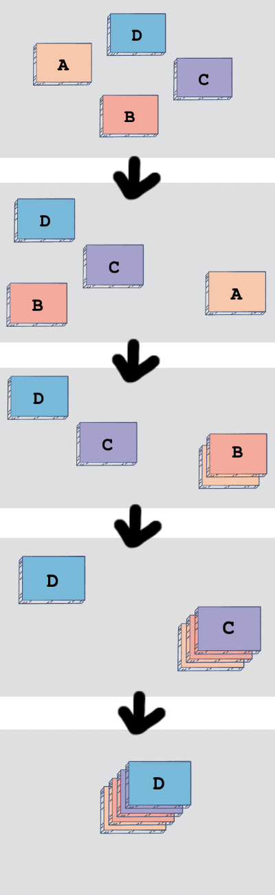
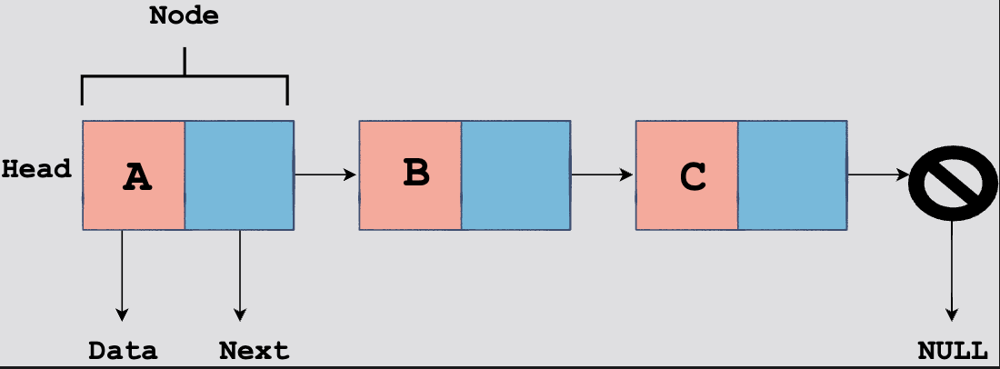
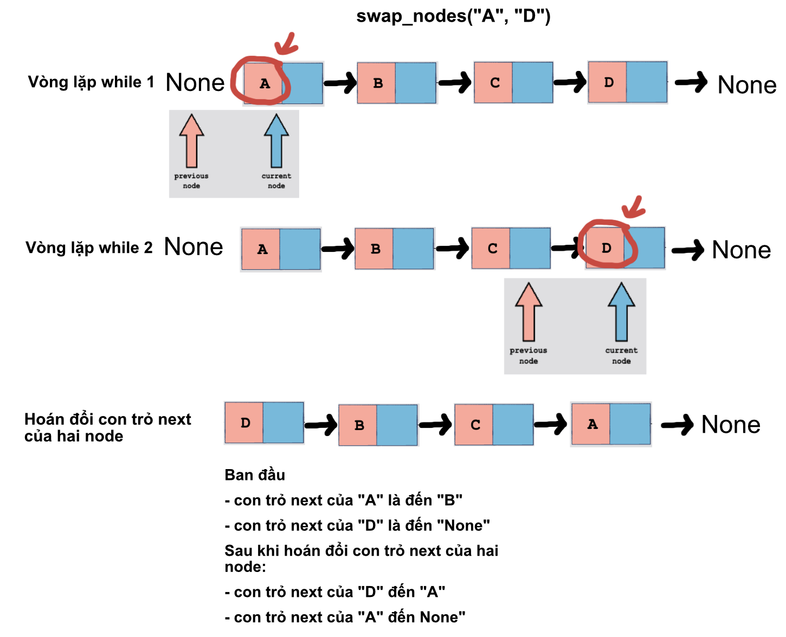
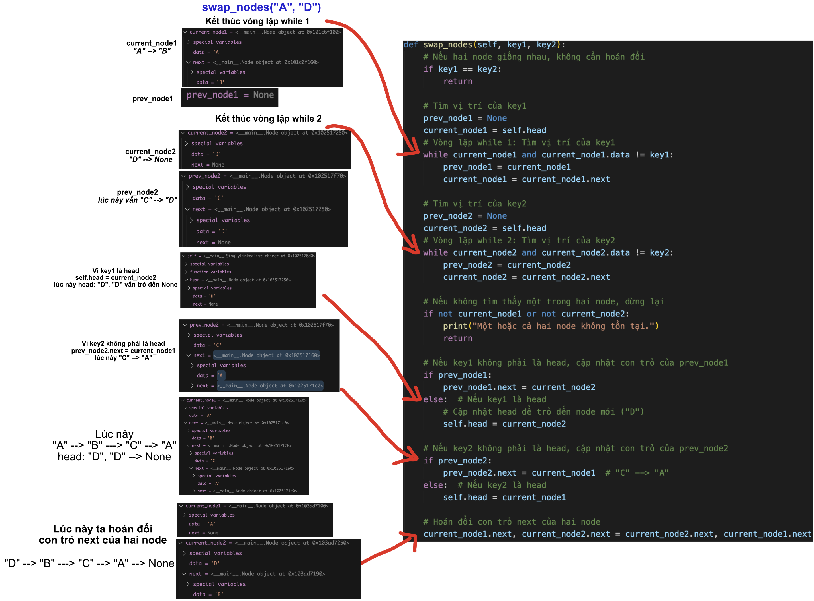
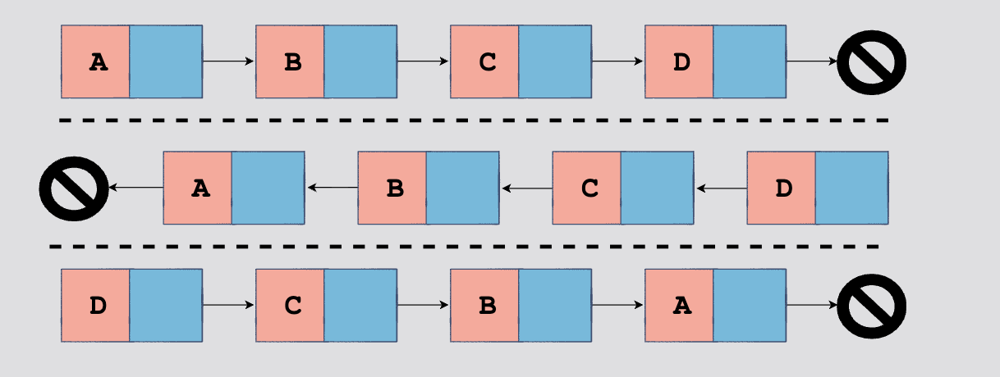

- [Data Structures và Algorithms trong Python](#data-structures-và-algorithms-trong-python)
- [Built-in Data Structures](#built-in-data-structures)
  - [List](#list)
  - [Tuple](#tuple)
  - [Dictionary](#dictionary)
  - [Set](#set)
- [Stack](#stack)
  - [Các thao tác cơ bản trên stack](#các-thao-tác-cơ-bản-trên-stack)
  - [Determine if Brackets are Balanced](#determine-if-brackets-are-balanced)
  - [Reverse String](#reverse-string)
  - [Convert Decimal Integer to Binary](#convert-decimal-integer-to-binary)
- [Singly Linked List](#singly-linked-list)
  - [Giới thiệu](#giới-thiệu)
    - [display()](#display)
  - [Insertion](#insertion)
    - [Append](#append)
    - [Prepend](#prepend)
    - [Insert After Node](#insert-after-node)
    - [Insert a node at a specific position in a linked list](#insert-a-node-at-a-specific-position-in-a-linked-list)
  - [Deletion](#deletion)
    - [Xóa bởi giá trị](#xóa-bởi-giá-trị)
    - [Xóa bởi vị trí](#xóa-bởi-vị-trí)
  - [Length](#length)
    - [Iterative](#iterative)
    - [Recursive](#recursive)
  - [Node Swap](#node-swap)
    - [Giải thích](#giải-thích)
    - [Minh họa](#minh-họa)
  - [Reverse](#reverse)
    - [Iterative](#iterative-1)
  - [Merge Two Sorted Linked Lists](#merge-two-sorted-linked-lists)
  - [Remove Duplicates](#remove-duplicates)
  - [Nth-to-Last Node](#nth-to-last-node)
  - [Count Occurrences](#count-occurrences)
  - [Is Palindrome](#is-palindrome)
    - [Sử dụng List](#sử-dụng-list)
  - [Tóm tắt](#tóm-tắt-1)

# Data Structures và Algorithms trong Python

Cấu trúc dữ liệu và giải thuật là một trong những khái niệm cơ bản nhất của khoa học máy tính. Bài viết này bao gồm một số cấu trúc dữ liệu và thuật toán phổ biến nhất trong Python:

- Built-in Data Structures

- Stack

- Singly Linked Lists

- Circular Linked Lists

- Doubly Linked Lists

- Arrays

- Binary Trees

- Binary Search Trees

- Binary Search

- Recursion

- String Processing

# Built-in Data Structures

Vì chúng ta thường xuyên phải xử lý việc thao tác dữ liệu, nên việc tổ chức dữ liệu một cách hiệu quả và có ý nghĩa là điều vô cùng quan trọng.

Python được trang bị nhiều built-in data structures (cấu trúc dữ liệu tích hợp sẵn) để giúp chúng ta xử lý hiệu quả lượng lớn dữ liệu.

Bốn cấu trúc dữ liệu tích hợp chính mà `Python` cung cấp là:

- List
- Tuple
- Dictionary
- Set

## List

List là một trong những cấu trúc dữ liệu phổ biến và linh hoạt nhất trong Python. Nó cho phép chúng ta lưu trữ các phần tử có kiểu dữ liệu khác nhau trong một vùng chứa. Nội dung của một list được đặt bên trong dấu ngoặc vuông `[]`, và các phần tử được phân tách bởi dấu phẩy `,`.

**Đặc điểm của List**:

- Ordered: Các phần tử được lưu trữ tuyến tính tại một index cụ thể, chúng có một thứ tự nhất định. Khi bạn thêm các phần tử vào list, chúng sẽ được lưu trữ theo thứ tự mà bạn đã thêm vào.
- Có thể thay đổi (Mutable): Bạn có thể thay đổi, thêm, hoặc xóa các phần tử trong list sau khi nó đã được tạo ra.
- Cho phép các giá trị trùng lặp: List có thể chứa các phần tử giống nhau.

### Tạo một list

#### Bạn có thể tạo một list đơn giản như sau:

```python
# Tạo một list với các kiểu dữ liệu khác nhau
mixed_list = [1, "Hello", 3.14, True]
```

#### Sử dụng hàm `range()` để tạo một list:

Hàm range() trong Python được sử dụng để tạo ra một dãy số theo một quy tắc nhất định, `range(start, stop, step)`.

```python
# Tạo list từ 0 đến 9
numbers = list(range(10))
print(numbers)  # Output: [0, 1, 2, 3, 4, 5, 6, 7, 8, 9]

# Tạo list từ 5 đến 9
numbers = list(range(5, 10))
print(numbers)  # Output: [5, 6, 7, 8, 9]

# Tạo list từ 0 đến 9 với bước nhảy là 2
numbers = list(range(0, 10, 2))
print(numbers)  # Output: [0, 2, 4, 6, 8]

# Tạo list từ 10 đến 1 với bước nhảy là -1
numbers = list(range(10, 0, -1))
print(numbers)  # Output: [10, 9, 8, 7, 6, 5, 4, 3, 2, 1]
```

### Truy cập các phần tử trong List:

```python
fruits = ["apple", "banana", "watermelon", "cherry"]

# Truy cập phần tử đầu tiên
print(fruits[0])  # Output: apple

# Truy cập phần tử thứ hai
print(fruits[1])  # Output: banana

# Truy cập phần tử cuối cùng
print(fruits[-1])  # Output: cherry
```

### Thêm, xóa và thay đổi phần tử trong List:

#### Thêm phần tử

Bạn có thể thêm phần tử vào cuối list bằng phương thức `append()` hoặc thêm phần tử vào vị trí cụ thể bằng `insert()`.

```python
fruits = ["apple", "banana", "cherry"]

# Thêm phần tử vào cuối list
fruits.append("orange")

# Thêm phần tử vào vị trí thứ hai
fruits.insert(1, "mango")

print(fruits)  # Output: ['apple', 'mango', 'banana', 'cherry', 'orange']
```

#### Xóa phần tử

Bạn có thể xóa một phần tử bằng `remove()`, `pop()`, hoặc `del`.

```python
fruits = ["apple", "banana", "cherry"]

# Xóa phần tử cụ thể
fruits.remove("banana") # Output: ['apple', 'cherry']

# Xóa phần tử cuối cùng
last_fruit = fruits.pop() # Output: ['apple']

# Xóa phần tử theo index
del fruits[0]

print(fruits)  # Output: []
```

#### Thay đổi phần tử

Bạn có thể thay đổi giá trị của phần tử bằng cách truy cập trực tiếp vào index của nó.

```python
fruits = ["apple", "banana", "cherry"]

# Thay đổi giá trị của phần tử thứ hai
fruits[1] = "blueberry"

print(fruits)  # Output: ['apple', 'blueberry', 'cherry']
```

#### Một số phương thức hữu ích khác cho List:

- `sort()`: Sắp xếp các phần tử trong list.
- `reverse()`: Đảo ngược thứ tự các phần tử trong list.
- `len()`: Trả về số lượng các phần tử trong list.
- `index()`: Trả về chỉ số của phần tử đầu tiên khớp với giá trị được chỉ định.

```python
numbers = [3, 1, 4, 1, 5, 9]

# Sắp xếp list
numbers.sort()
print(numbers)  # Output: [1, 1, 3, 4, 5, 9]

# Đảo ngược list
numbers.reverse()
print(numbers)  # Output: [9, 5, 4, 3, 1, 1]

# Độ dài của list
print(len(numbers))  # Output: 6

# Index của phần tử đầu tiên có giá trị 4
print(numbers.index(4))  # Output: 2
```

### List sclicing

```python
numbers = [0, 1, 2, 3, 4, 5, 6, 7, 8, 9]

# Lấy các phần tử từ index 2 đến index 5 (không bao gồm index 5)
subset = numbers[2:5]
print(subset)  # Output: [2, 3, 4]

# Lấy các phần tử từ đầu đến index 4 (không bao gồm index 4)
start_slice = numbers[:4]
print(start_slice)  # Output: [0, 1, 2, 3]

# Lấy các phần tử từ index 5 đến hết list
end_slice = numbers[5:]
print(end_slice)  # Output: [5, 6, 7, 8, 9]

# Lấy các phần tử từ index 1 đến index 7 với step (bước nhảy) là 2
step_slice = numbers[1:8:2]
print(step_slice)  # Output: [1, 3, 5, 7]

# Đảo ngược list
reversed_list = numbers[::-1]
print(reversed_list)  # Output: [9, 8, 7, 6, 5, 4, 3, 2, 1, 0]

# Sao chép toàn bộ list
copied_list = numbers[:]
print(copied_list)  # Output: [0, 1, 2, 3, 4, 5, 6, 7, 8, 9]

# Lấy 3 phần tử cuối cùng
last_three = numbers[-3:]
print(last_three)  # Output: [7, 8, 9]

```

### List Comprehension

List Comprehension là một cách ngắn và gọn gàng để tạo ra các list mới từ các list hiện có bằng cách sử dụng cú pháp đơn giản kết hợp giữa vòng lặp `for` và điều kiện `if`

Cú pháp của list comprehension như sau:

```python
new_list = [expression for item in iterable if condition]
```

- expression: Biểu thức được áp dụng lên từng phần tử.
- item: Từng phần tử trong iterable (list, tuple, string, v.v.).
- condition (tuỳ chọn): Điều kiện để chọn các phần tử đưa vào list mới.

### Tạo một list mới từ một list hiện có

```python
numbers = [1, 2, 3, 4, 5]
squares = [x**2 for x in numbers]

print(squares)  # Output: [1, 4, 9, 16, 25]
```

### Sử dụng if-else trong List Comprehension

```python
numbers = [1, 2, 3, 4, 5, 6, 7, 8, 9, 10]
evens = [x for x in numbers if x % 2 == 0]

print(evens)  # Output: [2, 4, 6, 8, 10]

numbers = [1, 2, 3, 4, 5]
results = [x*2 if x % 2 == 0 else x*3 for x in numbers]

print(results)  # Output: [3, 4, 9, 8, 15]
```

### List comprehension dùng với nhiều list

```python
list1 = [30, 50, 110, 40, 15, 75]
list2 = [10, 60, 20, 50]

sum_list = [(n1, n2) for n1 in list1 for n2 in list2 if n1 + n2 > 100]

print(sum_list) # Output: [(50, 60), (110, 10), (110, 60), (110, 20), (110, 50), (75, 60), (75, 50)]


```

## Tuple

Tuple thì gần giống như list, ngoại trừ việc tuple là immutable (không thể thay đổi). Điều này có nghĩa là sau khi ta tạo một tuple, ta không thể thay đổi, thêm, hoặc xóa các phần tử bên trong nó. Tuy nhiên, nó có thể chứa các phần tử có thể thay đổi (mutable elements) như một list.

Nội dung của tuple được đặt bên trong dấu ngoặc đơn `()` và các phần tử được phân tách bởi dấu phẩy `,`.

### Tạo một tuple

```python
# Tạo một tuple rỗng
empty_tuple = ()

# Tạo một tuple với nhiều phần tử
my_tuple = (1, 2, 3, "Hello", True)

```

Python cũng cho phép ta tạo tuple mà không cần dấu ngoặc đơn, chỉ cần sử dụng dấu phẩy:

```python
my_tuple = 1, 2, 3, "Hello", True
```

### Truy cập các phần tử trong Tuple

```python
my_tuple = (1, 2, 3, "Hello", True)

# Truy cập phần tử đầu tiên
print(my_tuple[0])  # Output: 1

# Truy cập phần tử cuối cùng
print(my_tuple[-1])  # Output: True
```

### Merging tuples

Tuples có thể được merged bằng cách sử dụng toán tử `+`.

```python
hero1 = ("Batman", "Wonder Woman")
hero2 = ("Wonder Woman", "Diana Prince")
awesome_team = hero1 + hero2
print(awesome_team) # Output: ('Batman', 'Wonder Woman', 'Wonder Woman', 'Diana Prince')

```

### Nested Tuples

```python
nested_tuple = (1, 2, (3, 4), 5)

# Truy cập phần tử bên trong tuple lồng nhau
print(nested_tuple[2][1])  # Output: 4
```

Một ví dụ khác về nested tuples:

```python
hero1 = ("Batman", "Bruce Wayne")
hero2 = ("Wonder Woman", "Diana Prince")
awesome_team = (hero1, hero2)
print(awesome_team) # Output: (('Batman', 'Bruce Wayne'), ('Wonder Woman', 'Diana Prince'))

```

### Một số thao tác với Tuple

#### Tìm kiếm

Chúng ta có thể kiểm tra xem một phần tử có tồn tại trong một tuple hay không bằng cách sử dụng toán tử `in` như sau:

```python
cities = ("London", "Paris", "Los Angeles", "Tokyo")
print("Moscow" in cities) # Output: False
```

Hàm `index()` có thể cung cấp cho chúng ta index của một giá trị cụ thể:

```python
cities = ("London", "Paris", "Los Angeles", "Tokyo")
print(cities.index("Tokyo")) # Output: 3
```

#### Slicing tuple

Tương tự như với list

```python
my_tuple = (1, 2, 3, 4, 5)
slice_tuple = my_tuple[1:4]
print(slice_tuple)  # Output: (2, 3, 4)

```

### Vậy tại sao cần tuple khi đã có list?

- Immutable: Tính không thể thay đổi giúp tuple an toàn hơn khi ta cần lưu trữ các giá trị không muốn bị thay đổi sau khi tạo ra.
- Hiệu suất: Tuple thường có hiệu suất tốt hơn list trong các tình huống không cần thay đổi dữ liệu.
- Tuple có thể làm key cho dictionary: Do tính immutable, tuple có thể được sử dụng làm key trong dictionary (trong khi list thì không).

#### Ví dụ về sử dụng tuple làm key trong dictionary:

```python
# Tạo dictionary với khóa là tuple (tọa độ) và giá trị là tên thành phố
cities = {
    (40.7128, -74.0060): "New York",
    (34.0522, -118.2437): "Los Angeles",
    (51.5074, -0.1278): "London",
    (48.8566, 2.3522): "Paris"
}

# Truy cập tên thành phố dựa trên tọa độ
location = (40.7128, -74.0060)
city_name = cities[location]
print(f"Thành phố tại tọa độ {location} là {city_name}")
# Output: Thành phố tại tọa độ (40.7128, -74.0060) là New York
```

[Tham khảo thêm](https://stackoverflow.com/questions/1938614/in-what-case-would-i-use-a-tuple-as-a-dictionary-key)

## Dictionary

So với list hoặc tuple, dictionary có cấu trúc phức tạp hơn một chút.

Dictionary trong Python là một cấu trúc dữ liệu cho phép ta lưu trữ các cặp key-value (khóa-giá trị). Mỗi khóa là duy nhất và được sử dụng để truy xuất giá trị tương ứng. Dictionary là một kiểu dữ liệu mutable, có nghĩa là ta có thể thay đổi nội dung của nó sau khi tạo.

Trong Python, nội dung của dictionary được đặt bên trong dấu ngoặc nhọn `{}`, và mỗi cặp key-value được phân tách bởi dấu hai chấm `:`. Các cặp key-value được phân tách bởi dấu phẩy `,`.

Trong các phiên bản Python trước 3.6, dictionary là unordered. Kể từ Python 3.7, các dictionary trở nên ordered theo mặc định. Ta sẽ xem ví dụ ngay dưới đây

### Tạo một dictionary

```python
empty_dict = {}  # Dictionary rỗng
print(empty_dict) # {}
```

#### Python version 3

```python
films = {"The Gentlemen": 2019,
            "The Terminal List": 2022,
            "Guy Ritchie's The Covenant": 2023}
print(films) # {'The Terminal List': 2022, "Guy Ritchie's The Covenant": 2023, 'The Gentlemen': 2019}

```

#### Python version 3.9.6

```python
films = {"The Gentlemen": 2019,
            "The Terminal List": 2022,
            "Guy Ritchie's The Covenant": 2023}
print(films) # {'The Gentlemen': 2019, 'The Terminal List': 2022, "Guy Ritchie's The Covenant": 2023}
```

### `dict()` Constructor

Như tên gọi, `dict()` constructor có thể được sử dụng để tạo ra một dictionary.

Nếu các khóa (keys) của chúng ta là các chuỗi đơn giản không có ký tự đặc biệt, chúng ta có thể tạo các item trong dictionary trực tiếp trong constructor. Trong trường hợp này, giá trị sẽ được gán cho các khóa bằng cách sử dụng toán tử `=`.

Việc sử dụng `dict()` có thể làm cho code của ta ngắn gọn và dễ đọc hơn trong một số trường hợp nhất định.

#### Refactor các ví dụ ở trên:

Thay vì viết:

```python
empty_dict = {}
```

Có thể viết lại như sau:

```python
empty_dict = dict()
```

Thay vì viết:

```python
phone_book = {
    'John': 123456789,
    'Alice': 987654321,
    'Bob': 456789123
}
```

Ta có thể viết lại thành:

```python
phone_book = dict(John=123456789, Alice=987654321, Bob=456789123)
```

### Truy cập giá trị trong Dictionary

Đối với nhiều người, đây là điểm mà dictionary có ưu thế hơn so với list hoặc tuple. Vì không có các chỉ mục tuyến tính (linear indices), chúng ta không cần phải theo dõi vị trí lưu trữ của các giá trị.

Thay vào đó, chúng ta có thể truy cập một giá trị của dict theo cú pháp `[key]`. Điều này có ý nghĩa hơn so với việc sử dụng các chỉ số nguyên (integer indices) mà chúng ta sử dụng cho tuples và lists.

Ngoài ra, chúng ta cũng có thể sử dụng phương thức `get()` để truy cập giá trị như sau:

```python
# Ví dụ về việc truy cập giá trị bằng key trong dictionary
phone_book = {'John': 123456789, 'Alice': 987654321, 'Bob': 456789123}

# Truy cập giá trị bằng dấu ngoặc vuông []
john_number = phone_book['John']
print(john_number)  # Output: 123456789

# Truy cập giá trị bằng phương thức get()
alice_number = phone_book.get('Alice')
print(alice_number)  # Output: 987654321
```

#### Lợi ích của việc sử dụng `get()`:

An toàn hơn khi key không tồn tại: Khi sử dụng dấu ngoặc vuông `[]` để truy cập một giá trị mà key không tồn tại trong dictionary, Python sẽ phát sinh lỗi `KeyError`. Tuy nhiên, với phương thức `get()`, nếu key không tồn tại, thay vì phát sinh lỗi, Python sẽ trả về `None` hoặc một giá trị mặc định mà ta có thể xác định.

Ví dụ

```python
# Sử dụng dấu ngoặc vuông có thể gây lỗi nếu key không tồn tại
try:
  non_existent = phone_book['Michael']  # KeyError nếu 'Michael' không có trong dictionary
except KeyError:
  print("Key không tồn tại")

# Sử dụng get() để tránh lỗi
non_existent = phone_book.get('Michael')
print(non_existent)  # Output: None (không gây lỗi)

# Trả về giá trị mặc định khi key không tồn tại
non_existent_with_default = phone_book.get('Michael', 'Không tìm thấy')
print(non_existent_with_default)  # Output: Không tìm thấy
```

### Dictionary Operations

#### Thêm/Cập nhật

```python
# Tạo một dictionary
phone_book = {'John': 123456789, 'Alice': 987654321}

# Thêm item mới
phone_book['Bob'] = 456789123
print(phone_book)  # Output: {'John': 123456789, 'Alice': 987654321, 'Bob': 456789123}

# Cập nhật item hiện có
phone_book['Alice'] = 111111111
print(phone_book)  # Output: {'John': 123456789, 'Alice': 111111111, 'Bob': 456789123}
```

#### Xóa

- Dùng `del`: Xóa một mục bằng cách chỉ định key.
- Dùng `pop()`: Xóa một mục và trả về giá trị của mục đó.
- Dùng `popitem()`: Xóa và trả về cặp `key-value` cuối cùng trong dictionary.
- Dùng `clear()`: Xóa tất cả các mục trong dictionary.

```python
# Xóa item bằng del
del phone_book['John']
print(phone_book)  # Output: {'Alice': 111111111, 'Bob': 456789123}

# Xóa item bằng pop()
bob_number = phone_book.pop('Bob')
print(bob_number)  # Output: 456789123
print(phone_book)  # Output: {'Alice': 111111111}

# Xóa và trả về item cuối cùng bằng popitem()
last_item = phone_book.popitem()
print(last_item)  # Output: ('Alice', 111111111)
print(phone_book)  # Output: {}

# Xóa tất cả các item bằng clear()
phone_book.clear()
print(phone_book)  # Output: {}

```

#### Độ dài của một Dictionary

```python
phone_book = {'John': 123456789, 'Alice': 111111111, 'Bob': 456789123}
length = len(phone_book)
print(length)  # Output: 3
```

#### Kiểm tra Sự Tồn tại của Key

Ta có thể kiểm tra xem một key có tồn tại trong dictionary hay không bằng cách sử dụng từ khóa `in`:

```python
if 'Alice' in phone_book:
    print("Alice có trong danh bạ")
else:
    print("Alice không có trong danh bạ")

# Output: Alice có trong danh bạ
```

#### Sao chép nội dung

```python
# Sao chép bằng copy()
phone_book_copy = phone_book.copy()
print(phone_book_copy) # Output: {'John': 123456789, 'Alice': 111111111, 'Bob': 456789123}

# Sao chép bằng dict()
phone_book_copy_2 = dict(phone_book)
print(phone_book_copy_2) # Output: {'John': 123456789, 'Alice': 111111111, 'Bob': 456789123}

```

#### Dictionary Comprehension

Dictionary Comprehension là một cách ngắn gọn và mạnh mẽ để tạo dictionary mới từ một iterable (như list, tuple, hay một dictionary khác). Cú pháp của nó tương tự như List Comprehension nhưng kết quả là một dictionary.

```python
# Tạo dictionary với các số và bình phương của chúng
squares = {x: x**2 for x in range(6)}
print(squares)  # Output: {0: 0, 1: 1, 2: 4, 3: 9, 4: 16, 5: 25}

# Dictionary Comprehension từ một dictionary có sẵn
phone_book = {'John': 123456789, 'Alice': 111111111, 'Bob': 456789123}
filtered_phone_book = {k: v for k, v in phone_book.items() if v != 111111111}
print(filtered_phone_book)  # Output: {'John': 123456789, 'Bob': 456789123}
```

## Set

Set trong Python là một cấu trúc dữ liệu được sử dụng để lưu trữ một tập hợp các phần tử mà mỗi phần tử là duy nhất và không có thứ tự (unordered).

Ta có thể tạo một set bằng cách đặt các phần tử vào trong dấu ngoặc nhọn `{}`, hoặc sử dụng hàm `set()`.

### Tạo một set

```python
# Tạo một set rỗng
empty_set = set()
print(empty_set)  # Output: set()

# Tạo một set
random_set = {"Educative", 1408, 3.142, (True, False)}
print(random_set) # Output: {1408, (True, False), 3.142, 'Educative'}

# Tạo một set từ một chuỗi, các ký tự sẽ là các phần tử trong set
char_set = set("hello")
print(char_set)  # Output: {'h', 'e', 'l', 'o'}
```

### Các thao tác cơ bản với Set

#### Thêm phần tử vào Set

```python
my_set = {1, 2, 3}
my_set.add(4)
print(my_set)  # Output: {1, 2, 3, 4}
```

#### Xóa phần tử khỏi Set

Ta có thể xóa một phần tử khỏi set bằng cách sử dụng `remove()` hoặc `discard()`:

- `remove()` sẽ phát sinh lỗi nếu phần tử không tồn tại trong set.
- `discard()` sẽ không phát sinh lỗi nếu phần tử không tồn tại.

```python
my_set = {1, 2, 3, 4}
my_set.remove(2)
print(my_set)  # Output: {1, 3, 4}

my_set.discard(5)  # Không phát sinh lỗi mặc dù 5 không có trong set
print(my_set)  # Output: {1, 3, 4}
```

#### Kiểm tra sự tồn tại của phần tử trong Set

Ta có thể sử dụng toán tử `in` để kiểm tra xem một phần tử có tồn tại trong set hay không.

```python
my_set = {1, 2, 3}
print(2 in my_set)  # Output: True
print(5 in my_set)  # Output: False
```

### Các phép toán trên tập hợp

#### Union

Tạo một set mới chứa tất cả các phần tử từ cả hai set.

```python
set1 = {1, 2, 3}
set2 = {3, 4, 5}
union_set = set1.union(set2)
print(union_set)  # Output: {1, 2, 3, 4, 5}
```

#### Intersection

Tạo một set mới chứa các phần tử có trong cả hai set.

```python
intersection_set = set1.intersection(set2)
print(intersection_set)  # Output: {3}
```

#### Difference

Tạo một set mới chứa các phần tử có trong set đầu tiên nhưng không có trong set thứ hai.

```python
difference_set = set1.difference(set2)
print(difference_set)  # Output: {1, 2}
```

#### Symmetric Difference

Tạo một set mới chứa các phần tử có trong set này hoặc set kia nhưng không có trong cả hai set.

```python
symmetric_difference_set = set1.symmetric_difference(set2)
print(symmetric_difference_set)  # Output: {1, 2, 4, 5}
```

### Ứng dụng của Set

#### Loại bỏ các phần tử trùng lặp

Set rất hữu ích khi ta cần loại bỏ các phần tử trùng lặp từ một danh sách.

```python
my_list = [1, 2, 2, 3, 4, 4, 5]
unique_set = set(my_list)
print(unique_set)  # Output: {1, 2, 3, 4, 5}
```

#### Thực hiện các phép toán tập hợp

Như đã đề cập, set cho phép ta dễ dàng thực hiện các phép toán tập hợp như hợp, giao, hiệu, hiệu đối xứng.

### Tóm tắt

#### List

Đặc điểm: List là một cấu trúc dữ liệu có thứ tự (ordered), có thể thay đổi (mutable), và cho phép các phần tử trùng lặp.

#### Tuple

Đặc điểm: Tuple là một cấu trúc dữ liệu có thứ tự (ordered) nhưng không thể thay đổi (immutable), và cũng cho phép các phần tử trùng lặp.

#### Dictionary

Đặc điểm: Dictionary là một cấu trúc dữ liệu không có thứ tự (unordered) trong các phiên bản Python trước 3.7, và có thứ tự (ordered) từ Python 3.7 trở đi. Dictionary có thể thay đổi (mutable) và lưu trữ các cặp key-value (khóa-giá trị), trong đó các key là duy nhất.

#### Set

Đặc điểm: Set là một cấu trúc dữ liệu không có thứ tự (unordered) và không chứa các phần tử trùng lặp. Set có thể thay đổi (mutable).

# Stack

Stack là một cấu trúc dữ liệu tuân theo nguyên tắc LIFO (Last In, First Out), nghĩa là phần tử được thêm vào cuối cùng sẽ được lấy ra đầu tiên.

Giả sử ta có 4 cuốn sách và sắp xếp nó thành một stack:



Ví dụ, nếu anh muốn lấy Book A và nó đang nằm ở dưới đáy của chồng sách, anh sẽ phải lần lượt lấy Book D, rồi Book C, và Book B xuống trước, rồi mới có thể lấy được Book A.

Stack trong lập trình hoạt động rất giống với chồng sách mà ta thấy ở trên. Stack là một cấu trúc dữ liệu cho phép ta "đặt" (push) bất kỳ đối tượng, biến hoặc giá trị nào lên trên cùng, giống như cách ta đặt sách lên chồng. Khi ta muốn "lấy" (pop) một giá trị, ta sẽ lấy giá trị ở trên cùng trước, tương tự như lấy cuốn sách trên cùng của chồng sách.

## Các thao tác cơ bản trên stack

- Push: Thêm một phần tử vào đỉnh (top) của stack.
- Pop: Xóa và trả về phần tử ở đỉnh của stack.
- Peek: Trả về phần tử ở đỉnh của stack mà không xóa nó.
- isEmpty: Kiểm tra xem stack có rỗng hay không.
- isFull: Kiểm tra xem stack có đầy không (nếu stack có giới hạn kích thước).

Giờ chúng ta sẽ tạo class Stack:

```python
"""
Stack Data Structure.
"""
class Stack:
    def __init__(self):
        # Khởi tạo stack như một danh sách trống
        self.stack = []

    def push(self, item):
        # Thêm một phần tử vào đỉnh của stack
        self.stack.append(item)

    def pop(self):
        # Xóa và trả về phần tử ở đỉnh của stack
        # Kiểm tra xem stack có rỗng không để tránh lỗi
        if not self.is_empty():
            return self.stack.pop()
        else:
            return "Stack is empty, cannot pop."

    def peek(self):
        # Trả về phần tử ở đỉnh của stack mà không xóa nó
        # Kiểm tra xem stack có rỗng không để tránh lỗi
        if not self.is_empty():
            return self.stack[-1]
        else:
            return "Stack is empty, no top element to peek."

    def is_empty(self):
        # Kiểm tra xem stack có rỗng không
        return len(self.stack) == 0

    def size(self):
        # Trả về số lượng phần tử trong stack
        return len(self.stack)

    def __str__(self):
        # Trả về nội dung của stack dưới dạng chuỗi để dễ quan sát
        return str(self.stack)

# Sử dụng lớp Stack
stack = Stack()

# Thêm các phần tử vào stack
stack.push(10)
stack.push(20)
stack.push(30)

print("Stack sau khi push các phần tử:", stack) # Output: Stack sau khi push các phần tử: [10, 20, 30]

# Xem phần tử ở đỉnh của stack
print("Phần tử ở đỉnh của stack (peek):", stack.peek()) # Output: Phần tử ở đỉnh của stack (peek): 30

# Xóa phần tử ở đỉnh của stack
print("Phần tử được lấy ra từ stack (pop):", stack.pop()) # Output: Phần tử được lấy ra từ stack (pop): 30
print("Stack sau khi pop:", stack) # Output: Stack sau khi pop: [10, 20]

# Kiểm tra xem stack có rỗng không
print("Stack có rỗng không?", stack.is_empty()) # Output: Stack có rỗng không? False

# Trả về kích thước của stack
print("Kích thước của stack:", stack.size()) # Output: Kích thước của stack: 2

```

## Determine if Brackets are Balanced

Cho một chuỗi chứa các dấu ngoặc `(), {}, []`. Nhiệm vụ của chúng ta là viết một hàm để kiểm tra xem các dấu ngoặc này có được sắp xếp hợp lệ hay không.

Ví dụ về Balanced Brackets

- `{ }`
- `{ } { }`
- `( ( { [ ] } ) )`

Ví dụ về Unbalanced Brackets

- `( ( )`
- `{ { { ) } ]`
- `[ ] [ ] ] ]`

### Cách tiếp cận

- Sử dụng một stack để lưu trữ các dấu mở ngoặc.
- Duyệt qua từng ký tự trong chuỗi:
  - Nếu gặp dấu mở ngoặc (`(, {, [`), thì đẩy nó vào stack.
  - Nếu gặp dấu đóng ngoặc (`), }, ]`):
    - Kiểm tra xem stack có rỗng không (nếu rỗng nghĩa là chuỗi không cân bằng).
    - Lấy phần tử trên cùng của stack ra và kiểm tra xem nó có tương ứng với dấu đóng hiện tại không. Nếu không, chuỗi không cân bằng.
- Cuối cùng, nếu stack rỗng thì chuỗi cân bằng, nếu không rỗng thì chuỗi không cân bằng.

`stack.py`

```python
"""
Stack Data Structure.
"""
class Stack():
    def __init__(self):
        self.items = []

    def push(self, item):
        self.items.append(item)

    def pop(self):
        return self.items.pop()

    def is_empty(self):
        return self.items == []

    def peek(self):
        if not self.is_empty():
            return self.items[-1]

    def get_stack(self):
        return self.items
```

`main.py`

```python
from stack import Stack

def is_match(p1, p2):
    if p1 == "(" and p2 == ")":
        return True
    elif p1 == "{" and p2 == "}":
        return True
    elif p1 == "[" and p2 == "]":
        return True
    else:
        return False


def is_paren_balanced(paren_string):
    s = Stack()
    is_balanced = True
    index = 0

    while index < len(paren_string) and is_balanced:
        paren = paren_string[index]
        if paren in "([{":
            s.push(paren)
        else:
            if s.is_empty():
                is_balanced = False
                break
            else:
                top = s.pop()
                if not is_match(top, paren):
                    is_balanced = False
                    break
        index += 1

    if s.is_empty() and is_balanced:
        return True
    else:
        return False

print("String : (((({})))) Balanced or not?")
print(is_paren_balanced("(((({}))))")) # Output: True


print("String : [][]]] Balanced or not?")
print(is_paren_balanced("[][]]]")) # Output: False

print("String : [][] Balanced or not?")
print(is_paren_balanced("[][]")) # Output: True

```

#### Giải thích hàm `is_paren_balanced(paren_string)`

Chúng ta khai báo một `Stack s` (ban đầu là rỗng), và hai biến `is_balanced` và `index` được gán giá trị lần lượt là `True` và `0`.

`is_balanced` sẽ được sử dụng để theo dõi trạng thái cân bằng của các dấu ngoặc, và `index` sẽ dùng để duyệt qua các ký tự trong chuỗi `paren_string`.

Vòng lặp `while` chạy cho đến khi chúng ta đã duyệt qua toàn bộ chuỗi hoặc cho đến khi phát hiện rằng chuỗi không cân bằng (`is_balanced` trở thành `False`).

Vòng lặp này duyệt qua từng ký tự trong chuỗi `paren_string` bằng cách sử dụng biến `index`. Ký tự hiện tại sẽ được lưu trong biến `paren`.

Tiếp theo, chương trình kiểm tra xem ký tự hiện tại (`paren`) có phải là một trong các dấu ngoặc mở (`(, {, [`) không.
Nếu đúng, dấu ngoặc mở được đẩy vào stack `s` bằng thao tác `s.push(paren)`.

Nếu ký tự không phải là dấu ngoặc mở:

- Kiểm tra xem stack `s` có rỗng không. Nếu stack rỗng, điều này có nghĩa là có một dấu ngoặc đóng mà không có dấu ngoặc mở tương ứng, do đó chuỗi không cân bằng (`is_balanced = False`), và chúng ta thoát khỏi vòng lặp (`break`).
- Nếu stack không rỗng:
  - Chúng ta lấy phần tử trên cùng của stack (`top = s.pop()`) và kiểm tra xem nó có khớp với dấu ngoặc đóng hiện tại hay không bằng cách sử dụng hàm `is_match`.
  - Nếu dấu ngoặc mở ở đỉnh của stack không khớp với dấu ngoặc đóng hiện tại, chuỗi không cân bằng (`is_balanced = False`), và chúng ta thoát khỏi vòng lặp (`break`).

Tiếp theo, tăng giá trị `index` để tiếp tục duyệt qua ký tự tiếp theo trong chuỗi.

Sau khi vòng lặp `while` kết thúc, chúng ta kiểm tra xem stack có rỗng và biến `is_balanced` có vẫn là `True` không.

- Nếu cả hai điều kiện đều đúng, điều đó có nghĩa là chuỗi có các dấu ngoặc cân bằng hoàn toàn, và hàm sẽ trả về `True`.

Nếu stack không rỗng hoặc biến `is_balanced` là `False`, điều này có nghĩa là chuỗi không cân bằng, và hàm sẽ trả về `False`.

#### Giải thích hàm `is_match(p1, p2)`

Hàm `is_match` được sử dụng để kiểm tra xem hai ký tự, cụ thể là `p1` và `p2`, có phải là một cặp dấu ngoặc hợp lệ hay không. Để `p1` và `p2` khớp nhau:

- `p1` phải là một dấu ngoặc mở (`(, {, [`).
- `p2` phải là dấu ngoặc đóng tương ứng (`), }, ]`).

Nếu `p1` và `p2` khớp nhau theo đúng điều kiện trên, hàm sẽ trả về `True`. Nếu không, hàm sẽ trả về `False`.

## Reverse String

Thuật toán để đảo ngược một chuỗi bằng cách sử dụng stack là khá đơn giản và hiệu quả. Thuật toán này hoạt động dựa trên tính chất LIFO (Last-In, First-Out) của stack, nghĩa là phần tử được đưa vào sau cùng sẽ được lấy ra đầu tiên. Khi chúng ta đẩy tất cả các ký tự của chuỗi vào stack, và sau đó lấy chúng ra theo thứ tự ngược lại, chúng ta sẽ thu được một chuỗi đã được đảo ngược.

- Bằng cách duyệt qua từng ký tự trong chuỗi và đẩy nó vào stack, chúng ta lưu trữ các ký tự theo thứ tự ngược lại trong stack.
- Khi chúng ta lần lượt lấy từng ký tự ra từ stack, ký tự đầu tiên được đẩy vào sẽ là ký tự cuối cùng được lấy ra, giúp tạo ra chuỗi đảo ngược.

`main.py`

```python
from stack import Stack
def reverse_string(stack, input_str):

    for i in range(len(input_str)):
        stack.push(input_str[i])

    rev_str = ""

    while not stack.is_empty():
        rev_str += stack.pop()

    return rev_str

stack = Stack()
input_str = "!olbiV ot emocleW"
print(reverse_string(stack, input_str)) # Output: Welcome to Viblo!
```

- Vòng lặp for này lặp qua từng ký tự trong chuỗi `input_str` bằng cách sử dụng index `i`.
- Mỗi ký tự từ `input_str[i]` được đưa vào stack thông qua phương thức `stack.push(input_str[i])`.
- Kết quả là tất cả các ký tự của `input_str` được đẩy vào stack theo thứ tự từ đầu đến cuối.
- Biến `rev_str` được khởi tạo là một chuỗi trống `("")`.
- Biến này sẽ được sử dụng để xây dựng chuỗi đã được đảo ngược.
- Vòng lặp while này tiếp tục chạy miễn là stack không rỗng (`not stack.is_empty()`).
- Trong mỗi lần lặp, phần tử trên cùng của stack được lấy ra bằng phương thức `stack.pop()` và được nối thêm vào chuỗi `rev_str`.
- Vì stack là cấu trúc dữ liệu LIFO (Last-In, First-Out), các ký tự được đưa vào sau cùng sẽ được lấy ra trước, do đó `rev_str` sẽ chứa các ký tự theo thứ tự ngược lại so với chuỗi ban đầu.
- Sau khi vòng lặp while kết thúc (nghĩa là stack đã rỗng), chuỗi `rev_str` sẽ chứa phiên bản đảo ngược của `input_str`.
- Hàm `reverse_string` trả về chuỗi `rev_str` này.

## Convert Decimal Integer to Binary

`main.py`

```python
from stack import Stack

def convert_int_to_bin(dec_num):

    if dec_num == 0:
        return 0

    s = Stack()

    while dec_num > 0:
        remainder = dec_num % 2
        s.push(remainder)
        dec_num = dec_num // 2

    bin_num = ""
    while not s.is_empty():
        bin_num += str(s.pop())

    return bin_num

print(convert_int_to_bin(56)) # Output: 111000
print(convert_int_to_bin(2)) # Output: 10
print(convert_int_to_bin(32)) # Output: 100000
print(convert_int_to_bin(10)) # Output: 1010
print(int(convert_int_to_bin(56),2)==56) # Output: True
```

Hàm này chuyển đổi một số nguyên thập phân (`dec_num`) sang dạng nhị phân bằng cách chia liên tục số đó cho `2` và lưu trữ phần dư vào stack. Sau khi quá trình chia hoàn tất, các phần dư sẽ được lấy ra từ stack để tạo thành số nhị phân.

- Hàm bắt đầu bằng việc kiểm tra nếu `dec_num` bằng `0`, hàm sẽ trả về `0`.
- Một đối tượng stack `s` được khởi tạo. Stack này sẽ được sử dụng để lưu trữ các phần dư khi thực hiện phép chia.

- Vòng lặp while chạy cho đến khi `dec_num` lớn hơn `0`. Ở mỗi vòng lặp:
  - `remainder = dec_num % 2`: Tính phần dư của `dec_num` khi chia cho `2`. Phần dư này sẽ là một trong các chữ số trong biểu diễn nhị phân.
  - `s.push(remainder)`: Phần dư được đẩy vào stack.
  - `dec_num = dec_num // 2`: Cập nhật giá trị `dec_num` bằng thương của phép chia `dec_num` cho `2`.
- Phần dư của mỗi phép chia biểu diễn các bit nhị phân từ phải sang trái, vì vậy các bit này được đẩy vào stack để sau này có thể lấy ra theo thứ tự ngược lại.

- Sau khi đã đẩy tất cả các phần dư vào stack, hàm tạo một chuỗi trống `bin_num` để lưu trữ số nhị phân.
- Vòng lặp while tiếp tục chạy cho đến khi stack rỗng (`s.is_empty()` trả về `True`):

  - `bin_num += str(s.pop())`: Mỗi lần lặp, phần tử trên cùng của stack (là một chữ số nhị phân) được lấy ra và nối vào chuỗi `bin_num`.
  - Vì các phần tử được đẩy vào stack từ phải sang trái, nên khi lấy ra từ stack, chúng sẽ được xếp đúng thứ tự để tạo thành số nhị phân.

- Cuối cùng, hàm trả về chuỗi nhị phân `bin_num`, là kết quả của quá trình chuyển đổi từ số nguyên thập phân ban đầu.

**Ví dụ**
Nếu `dec_num = 10`, thì:

- 10 chia 2 dư 0 (push 0 vào stack)
- 5 chia 2 dư 1 (push 1 vào stack)
- 2 chia 2 dư 0 (push 0 vào stack)
- 1 chia 2 dư 1 (push 1 vào stack)

Stack sẽ chứa `[0, 1, 0, 1]`. Sau khi `pop` từ stack và nối lại, chuỗi kết quả sẽ là "`1010`", tức là dạng nhị phân của `10`.

# Singly Linked List

## Giới thiệu



Mỗi Singly Linked List bao gồm nhiều **nodes**, và mỗi node chứa hai thành phần chính:

1. **Data**

- Component data cho phép mỗi node trong singly linked list lưu trữ một phần tử dữ liệu. Phần tử này có thể là string, character, number, hoặc bất kỳ kiểu dữ liệu nào khác.

2. **Next** (con trỏ)

- Component thứ hai, là một con trỏ (pointer) trỏ từ node hiện tại đến node tiếp theo trong danh sách liên kết. Component `next` này giúp kết nối các node lại với nhau, tạo thành chuỗi liên kết.

**Head** là điểm bắt đầu của linked list. Head không phải là một node mà là một con trỏ trỏ đến node đầu tiên trong danh sách. Khi cần duyệt qua linked list hoặc truy cập một phần tử, chúng ta sẽ bắt đầu từ `head` và di chuyển theo hướng của các node tiếp theo bằng cách sử dụng con trỏ `next`.

Component cuối cùng của singly linked list là null. Trong Python là `None`, biểu thị rằng đây là node cuối cùng và không có node nào tiếp theo nữa.

```python
class Node:
    def __init__(self, data):
        self.data = data  # Dữ liệu mà node lưu trữ
        self.next = None  # Con trỏ trỏ đến node tiếp theo (ban đầu là None)

class SinglyLinkedList:
    def __init__(self):
        self.head = None  # Khởi tạo danh sách với head là None (danh sách trống)
```

### display()

Chúng ta sẽ bắt đầu từ con trỏ `head` và in ra dữ liệu của từng node, sau đó di chuyển đến node tiếp theo. Ta sẽ tiếp tục kiểm tra node tiếp theo để đảm bảo rằng nó không phải là `None`. Nếu không phải, ta sẽ tiếp tục di chuyển đến node kế tiếp. Quy trình này sẽ lặp lại cho đến khi chạm tới node cuối cùng, nơi con trỏ `next` là `None`.

```python
def display(self):
    current_node = self.head
    while current_node:  # Duyệt qua danh sách cho đến khi gặp None
        print(current_node.data, end=" -> ")
        current_node = current_node.next
    print("None")
```

## Insertion

### Append

Phương thức append sẽ chèn một phần tử vào cuối linked list.

#### Trường hợp Linked List rỗng

Khi triển khai phương thức `append` cho linked list, chúng ta cần xử lý trường hợp đặc biệt nếu linked list rỗng. Trong trường hợp list rỗng (tức là `head` bằng `None`), node mới sẽ trở thành `head` của danh sách. Dưới đây là cách triển khai phương thức `append` bao gồm xử lý cho trường hợp list rỗng:

```python

# Phương thức append: Chèn một phần tử mới vào cuối danh sách
def append(self, data):
    new_node = Node(data)
    # Nếu danh sách rỗng, node mới sẽ là head
    if not self.head:
        self.head = new_node
        return
```

#### Trường hợp Linked List không rỗng

Trong trường hợp linked list không rỗng, chúng ta cần duyệt qua linked list để tìm node cuối cùng và thêm node mới vào cuối danh sách.

```python

# Phương thức append: Chèn một phần tử mới vào cuối danh sách
def append(self, data):
    new_node = Node(data)
    # Nếu danh sách rỗng, node mới sẽ là head
    if not self.head:
        self.head = new_node
        return
    # Nếu danh sách không rỗng, tìm node cuối và gắn node mới vào cuối
    last_node = self.head
    while last_node.next:
        last_node = last_node.next
    last_node.next = new_node
```

#### Sử dụng append

```python
# Sử dụng danh sách liên kết
sll = SinglyLinkedList()

# Thêm các phần tử vào danh sách
sll.append(1)
sll.append(2)
sll.append(3)

# Hiển thị danh sách
sll.display() # Output: 1 -> 2 -> 3 -> None
```

### Prepend

Phương thức `prepend` sẽ chèn một phần tử vào đầu linked list. Khi thêm một node mới vào đầu danh sách, chúng ta chỉ cần thay đổi con trỏ head để trỏ đến node mới, và con trỏ của node mới sẽ trỏ đến
node cũ mà head trỏ đến trước đó.

```python
def prepend(self, data):
    new_node = Node(data)  # Tạo node mới
    new_node.next = self.head  # Con trỏ của node mới trỏ đến node đầu hiện tại
    self.head = new_node  # Cập nhật head để trỏ đến node mới
```

#### Sử dụng

```python
# Sử dụng danh sách liên kết
sll = SinglyLinkedList()

# Thêm các phần tử vào danh sách
sll.prepend("C")  # Danh sách: C
sll.prepend("B")  # Danh sách: B -> C
sll.prepend("A")  # Danh sách: A -> B -> C

# Thêm phần tử D vào đầu danh sách
sll.prepend("D")  # Danh sách: D -> A -> B -> C

# Hiển thị danh sách
sll.display() # Output: D -> A -> B -> C -> None
```

### Insert After Node

Phương thức `insert_after_node` sẽ chèn một node mới sau một node cụ thể đã có trong linked list. Để triển khai phương thức này, ta cần tìm node đích và sau đó thêm node mới ngay sau nó. Điều này yêu cầu cập nhật các con trỏ để đảm bảo rằng danh sách liên kết vẫn duy trì cấu trúc chính xác.

```python
def insert_after_node(self, prev_node_data, data):
    current_node = self.head
    while current_node:  # Duyệt qua danh sách
        if current_node.data == prev_node_data:  # Tìm node đích
            new_node = Node(data)  # Tạo node mới
            new_node.next = current_node.next  # Con trỏ của node mới trỏ đến node tiếp theo của node đích
            current_node.next = new_node  # Cập nhật con trỏ của node đích trỏ đến node mới
            return
        current_node = current_node.next
    print(f"Node với giá trị {prev_node_data} không tồn tại trong danh sách liên kết.")
```

#### Sử dụng:

```python
# Sử dụng danh sách liên kết
sll = SinglyLinkedList()

# Thêm các phần tử vào danh sách
sll.append("A")
sll.append("B")
sll.append("C")

# Chèn phần tử sau node "B"
sll.insert_after_node("B", "D")

# Hiển thị danh sách
sll.display() # Output: A -> B -> D -> C -> None

# Chèn phần tử sau node "F"
sll.insert_after_node("F", "D") # Output: Node với giá trị F không tồn tại trong danh sách liên kết.
```

### Insert a node at a specific position in a linked list

Để chèn một phần tử vào vị trí cụ thể trong singly linked list, ta cần xử lý hai trường hợp chính:

- Chèn tại vị trí 0: ta chỉ cần cập nhật **con trỏ next** của **node mới** để trỏ đến **head hiện tại**, sau đó cập nhật **head** trỏ đến **node mới**.
- Chèn tại vị trí bất kỳ khác: Nếu `position` lớn hơn 0, ta sẽ duyệt qua danh sách để tìm **node trước** (`prev_node`) vị trí cần chèn. Sau đó, ta chèn **node mới** **_giữa_** **node trước** và **node tại vị trí** đó.

```python
def insert_at_position(self, position, data):
    new_node = Node(data)

    # Trường hợp vị trí là 0 (chèn vào đầu danh sách)
    if position == 0:
        new_node.next = self.head
        self.head = new_node
        return

    # Trường hợp chèn vào vị trí bất kỳ khác
    current_node = self.head
    count = 0
    prev_node = None

    # Duyệt qua danh sách để tìm vị trí cần chèn
    while current_node and count < position:
        prev_node = current_node
        current_node = current_node.next
        count += 1

    # Nếu vị trí vượt quá kích thước của danh sách
    if count != position:
        print(f"Vị trí {position} vượt quá kích thước của danh sách.")
        return

    # Chèn node mới vào vị trí đã tìm thấy
    new_node.next = current_node
    prev_node.next = new_node
```

#### Sử dụng

```python
# Sử dụng danh sách liên kết
llist = SinglyLinkedList()

# Thêm các phần tử vào danh sách
llist.append("A")
llist.append("B")
llist.append("C")

# Hiển thị danh sách ban đầu
print("Danh sách ban đầu:")
llist.display()

# Chèn node tại vị trí 0 (đầu danh sách)
llist.insert_at_position(0, "D")

# Hiển thị danh sách sau khi chèn tại vị trí 0
print("\nDanh sách sau khi chèn tại vị trí 0:")
llist.display()

# Chèn node tại vị trí 2
llist.insert_at_position(2, "E")

# Hiển thị danh sách sau khi chèn tại vị trí 2
print("\nDanh sách sau khi chèn tại vị trí 2:")
llist.display()
```

Output

```Terminal
Danh sách ban đầu:

A -> B -> C -> None

Danh sách sau khi chèn tại vị trí 0:
D -> A -> B -> C -> None

Danh sách sau khi chèn tại vị trí 2:
D -> A -> E -> B -> C -> None

```

## Deletion

### Xóa bởi giá trị

Chúng ta có 2 trường hợp:

- Node cần xóa là node đầu tiên (head).
- Node cần xóa không phải là node đầu tiên (head).

#### Node cần xóa là node đầu tiên

Nếu node cần xóa là head, ta chỉ cần cập nhật con trỏ head để trỏ đến node tiếp theo của head. Điều này sẽ xóa đi liên kết của head hiện tại, và danh sách liên kết vẫn sẽ được duy trì.

```python
def delete_node(self, key):
    # Trường hợp node cần xóa là head
    if self.head and self.head.data == key:
        self.head = self.head.next
        return
```

#### Node cần xóa không phải là node đầu tiên

Nếu node cần xóa không phải là head, ta sẽ duyệt qua danh sách để tìm node trước node cần xóa. Sau khi tìm thấy, ta sẽ cập nhật con trỏ `next` của node trước này để trỏ đến node tiếp theo của node cần xóa, và điều này sẽ xóa bỏ node cần xóa ra khỏi danh sách.

```python
def delete_node(self, key):
    current_node = self.head

    # Trường hợp node cần xóa là head
    if current_node and current_node.data == key:
        self.head = current_node.next
        current_node = None
        return

    # Trường hợp node cần xóa không phải là head
    prev_node = None
    while current_node and current_node.data != key:
        prev_node = current_node
        current_node = current_node.next

    # Nếu node cần xóa không tồn tại trong danh sách
    if current_node is None:
        print(f"Node với giá trị {key} không tồn tại trong danh sách liên kết.")
        return

    # Cập nhật con trỏ của node trước trỏ đến node tiếp theo của node bị xóa
    prev_node.next = current_node.next
    current_node = None
```

#### Sử dụng

```python
    # Sử dụng danh sách liên kết

llist = SinglyLinkedList()

# Thêm các phần tử vào danh sách

llist.append("A")
llist.append("B")
llist.append("C")
llist.append("D")

# Hiển thị danh sách ban đầu

print("Danh sách ban đầu:")
llist.display()

# Xóa node "B" (không phải head)

llist.delete_node("B")

# Hiển thị danh sách sau khi xóa

print("\nDanh sách sau khi xóa B:")
llist.display()

# Xóa node "A" (là head)

llist.delete_node("A")

# Hiển thị danh sách sau khi xóa

print("\nDanh sách sau khi xóa A (head):")
llist.display()

```

Output

```Terminal
Danh sách ban đầu:
A -> B -> C -> D -> None

Danh sách sau khi xóa B:
A -> C -> D -> None

Danh sách sau khi xóa A (head):
C -> D -> None
```

### Xóa bởi vị trí

Để xóa một node theo vị trí cụ thể trong singly linked list (danh sách liên kết đơn), ta sẽ xử lý hai trường hợp:

- Node cần xóa ở vị trí 0 (node đầu tiên - head): Đây là trường hợp đặc biệt khi node cần xóa là head, ta chỉ cần cập nhật con trỏ head để trỏ đến node tiếp theo.

- Node cần xóa không ở vị trí 0: Trong trường hợp này, ta cần duyệt qua danh sách đến vị trí cần xóa, tìm node trước vị trí đó và cập nhật con trỏ của node trước để bỏ qua node cần xóa.

#### Xóa node ở vị trí 0

```python
def delete_at_position(self, position):
    if self.head is None:
        print("Danh sách trống.")
        return

    current_node = self.head

    # Trường hợp node cần xóa ở vị trí 0 (node đầu tiên)
    if position == 0:
        self.head = current_node.next  # Cập nhật head để trỏ đến node tiếp theo
        current_node = None
        return
```

#### Xóa node ở các vị trí khác

```python
def delete_at_position(self, position):
    if self.head is None:
        print("Danh sách trống.")
        return

    current_node = self.head

    # Trường hợp node cần xóa ở vị trí 0 (node đầu tiên)
    if position == 0:
        self.head = current_node.next  # Cập nhật head để trỏ đến node tiếp theo
        current_node = None
        return

    # Trường hợp node cần xóa không phải ở vị trí 0
    prev_node = None
    count = 0

    # Duyệt qua danh sách đến vị trí cần xóa
    while current_node and count != position:
        prev_node = current_node
        current_node = current_node.next
        count += 1

    # Nếu vị trí không tồn tại trong danh sách
    if current_node is None:
        print(f"Vị trí {position} vượt quá kích thước của danh sách.")
        return

    # Cập nhật con trỏ của node trước trỏ đến node tiếp theo của node bị xóa
    prev_node.next = current_node.next
    current_node = None
```

#### Sử dụng:

```python

# Sử dụng danh sách liên kết
llist = SinglyLinkedList()

# Thêm các phần tử vào danh sách

llist.append("A")
llist.append("B")
llist.append("C")
llist.append("D")
llist.append("E")

# Hiển thị danh sách ban đầu

print("Danh sách ban đầu:")
llist.display()

# Xóa node tại vị trí 0 (head)

llist.delete_at_position(0)

# Hiển thị danh sách sau khi xóa node tại vị trí 0

print("\nDanh sách sau khi xóa vị trí 0 (head):")
llist.display()

# Xóa node tại vị trí 2

llist.delete_at_position(2)

# Hiển thị danh sách sau khi xóa node tại vị trí 2

print("\nDanh sách sau khi xóa vị trí 2:")
llist.display()

```

Output

```Terminal
Danh sách ban đầu:

A -> B -> C -> D -> E -> None

Danh sách sau khi xóa vị trí 0 (head):
B -> C -> D -> E -> None

Danh sách sau khi xóa vị trí 2:
B -> C -> E -> None

```

**[File code singly-linked-list cho tới lúc này](https://github.com/tphuvu/python-notes/blob/sll-1/data-structures-and-algorithms/singly-linked-list.py)**

## Length

### Iterative

```python
def get_length_iterative(self):
    count = 0
    current_node = self.head
    while current_node:  # Duyệt qua danh sách cho đến khi gặp None
        count += 1
        current_node = current_node.next
    return count
```

### Recursive

```python
def get_length_recursive(self, node):
    # Nếu node là None, tức là danh sách rỗng
    if not node:
        return 0
    # Tính độ dài đệ quy cho các node tiếp theo
    return 1 + self.get_length_recursive(node.next)
```

## Node Swap

Trường hợp cần xử lý khi swap 2 nodes:

- Node 1 và Node 2 không phải là head.
- Một trong hai node là head.
- Hai node cần hoán đổi là giống nhau (không cần thực hiện gì).

Các bước để thực hiện swap 2 nodes:

- Tìm vị trí của hai node cần hoán đổi.
- Nếu một trong hai node là head, cập nhật con trỏ head để trỏ đến node kia.
- Cập nhật các con trỏ của các node trước hai node cần hoán đổi để giữ liên kết giữa các node trong danh sách.

```python
    def swap_nodes(self, key1, key2):
        # Nếu hai node giống nhau, không cần hoán đổi
        if key1 == key2:
            return

        # Tìm vị trí của key1
        prev_node1 = None
        current_node1 = self.head
        while current_node1 and current_node1.data != key1:
            prev_node1 = current_node1
            current_node1 = current_node1.next

        # Tìm vị trí của key2
        prev_node2 = None
        current_node2 = self.head
        while current_node2 and current_node2.data != key2:
            prev_node2 = current_node2
            current_node2 = current_node2.next

        # Nếu không tìm thấy một trong hai node (None), dừng lại
        if not current_node1 or not current_node2:
            print("Một hoặc cả hai node không tồn tại.")
            return
        # Nếu key1 không phải là head, cập nhật con trỏ của prev_node1
        if prev_node1:
            prev_node1.next = current_node2
        else:  # Nếu key1 là head
            self.head = current_node2

        # Nếu key2 không phải là head, cập nhật con trỏ của prev_node2
        if prev_node2:
            prev_node2.next = current_node1
        else:  # Nếu key2 là head
            self.head = current_node1
        # Hoán đổi con trỏ next của hai node
        current_node1.next, current_node2.next = current_node2.next, current_node1.next
```

Sử dụng:

```python
llist = SinglyLinkedList()

print("------------------------------")

llist.append("A")
llist.append("B")
llist.append("C")
llist.append("D")
# Hiển thị danh sách ban đầu
print("Danh sách ban đầu:")
llist.display()

# Hoán đổi hai node
llist.swap_nodes("A", "D")

# Hiển thị danh sách sau khi hoán đổi
print("\nDanh sách sau khi hoán đổi A và D:")
llist.display()
```

Output

```Terminal
------------------------------
Danh sách ban đầu:
A -> B -> C -> D -> None

Danh sách sau khi hoán đổi A và D:
D -> B -> C -> A -> None
```

### Giải thích



1. Tìm hai node cần hoán đổi:

- Ta duyệt qua danh sách liên kết để tìm `prev_node` và `current_node` cho cả hai node cần hoán đổi (`key1` và `key2`).

2. Cập nhật liên kết:

- Nếu một trong hai node là head, ta cập nhật head trỏ đến node kia.
- Sau đó, ta cập nhật con trỏ của node trước để nó trỏ đến node còn lại.

Ví dụ `key1` là `"A": head`, `key2` là `"D"` thì

- `self.head` sẽ trỏ đến `current_node2` `("D")`
- `prev_node2.next ("C")` sẽ trỏ đến `current_node1 ("A")`

3. Hoán đổi các con trỏ next:

- Cuối cùng, ta hoán đổi con trỏ next của hai node hiện tại (`current_node1.next` và `current_node2.next`) để hoàn tất việc hoán đổi các node trong danh sách liên kết. Sau `A` (`current_node1.next`) sẽ là `None` (`current_node2.next`) và sau `D` (`current_node2.next`) sẽ là `B` (`current_node1.next`)

4. Trường hợp không tìm thấy node:

- Nếu không tìm thấy một trong hai node, chương trình sẽ thông báo và dừng lại.

### Minh họa



**[File code singly-linked-list cho tới lúc này](https://github.com/tphuvu/python-notes/blob/sll-2/data-structures-and-algorithms/singly-linked-list.py)**

## Reverse

### Iterative



```python
def reverse_iterative(self):
    prev = None
    current = self.head
    while current:
        next_node = current.next  # Lưu trữ node tiếp theo
        current.next = prev  # Đảo ngược liên kết
        prev = current  # Di chuyển prev lên
        current = next_node  # Di chuyển current lên node tiếp theo
    self.head = prev  # Cập nhật head để trỏ đến node cuối cùng (bây giờ là node đầu tiên)
```

- `prev` bắt đầu là `None` vì node cuối cùng của danh sách liên kết đảo ngược sẽ trỏ đến `None`.
- `current` là `head`, ta se duyệt qua từng node trong danh sách liên kết. Tại mỗi bước:
  - Ta lưu trữ node tiếp theo của `current` trong `next_node`.
  - Đảo ngược liên kết của node hiện tại (`current.next`) để trỏ về node trước (`prev`).
  - Cập nhật `prev` thành `current` và `current` thành `next_node` để tiếp tục duyệt danh sách.
- Cuối cùng, `head` được cập nhật để trỏ đến node cuối cùng, là node đầu tiên trong danh sách đảo ngược.

## Merge Two Sorted Linked Lists

Ý tưởng cơ bản là so sánh các phần tử từ hai danh sách liên kết và xây dựng một danh sách mới bằng cách liên kết các node theo thứ tự.

```python
    def merge_sorted_lists(self, other_list):

        head1 = self.head  # con trỏ tới đầu danh sách 1
        head2 = other_list.head  # con trỏ tới đầu danh sách 2
        tail = None  # theo dõi phần cuối của merged list

        # Kiểm tra nếu danh sách đầu tiên rỗng
        if not head1:
            return head2
        # Kiểm tra nếu danh sách thứ hai rỗng
        if not head2:
            return head1

        # Bắt đầu so sánh giá trị của hai danh sách
        if head1 and head2:
            if head1.data <= head2.data:
                tail = head1
                head1 = tail.next
            else:
                tail = head2
                head2 = tail.next
            new_head = tail  # new_head là con trỏ tới đầu merged list

        # Duyệt qua hai danh sách và tiếp tục so sánh các phần tử
        while head1 and head2:
            if head1.data <= head2.data:
                tail.next = head1  # Kết nối node nhỏ hơn từ head1
                tail = head1
                head1 = tail.next
            else:
                tail.next = head2  # Kết nối node nhỏ hơn từ head2
                tail = head2
                head2 = tail.next

        # Nếu head1 hết node, nối phần còn lại của head2
        if not head1:
            tail.next = head2
        # Nếu head2 hết node, nối phần còn lại của head1
        if not head2:
            tail.next = head1

        self.head = new_head  # Cập nhật lại head của merged list
        return self.head
```

1. Kiểm tra danh sách rỗng:

- Nếu một trong hai danh sách rỗng, trả về danh sách còn lại.

2. Xác định node đầu tiên của merged list

- So sánh giá trị của node đầu tiên từ cả hai danh sách, chọn node có giá trị nhỏ hơn làm new_head (node đầu tiên của merged list).

3. Merge hai danh sách:

- Duyệt qua hai danh sách bằng cách so sánh từng node. Node nào nhỏ hơn sẽ được thêm vào merged list trước.

4. Nối phần còn lại:

- Khi một trong hai danh sách hết node, nối tất cả các node còn lại của danh sách kia vào.

5. Cập nhật `self.head`:

- Cập nhật `self.head` để trỏ đến node đầu tiên của merged list và trả về nếu có cần sử dụng cho mục đích khác.

### Sử dụng

```python
# Sử dụng danh sách liên kết
llist1 = SinglyLinkedList()
llist2 = SinglyLinkedList()

# Thêm các phần tử vào danh sách liên kết 1 (đã sắp xếp)
llist1.append(1)
llist1.append(3)
llist1.append(5)

# Thêm các phần tử vào danh sách liên kết 2 (đã sắp xếp)
llist2.append(2)
llist2.append(4)
llist2.append(6)

print("Danh sách liên kết 1:")
llist1.display()

print("Danh sách liên kết 2:")
llist2.display()

# Gộp hai danh sách liên kết đã sắp xếp
llist1.merge_sorted_lists(llist2)

print("\nDanh sách liên kết sau khi gộp:")
llist1.display()
```

Output

```Terminal
Danh sách liên kết 1:

1 -> 3 -> 5 -> None
Danh sách liên kết 2:
2 -> 4 -> 6 -> None

Danh sách liên kết sau khi gộp:
1 -> 2 -> 3 -> 4 -> 5 -> 6 -> None
```

## Remove Duplicates

- Duyệt qua danh sách liên kết, sử dụng **set** để lưu các giá trị đã gặp.
- Mỗi khi gặp một giá trị mới, thêm nó vào set.
- Nếu gặp một giá trị đã tồn tại trong set, ta xóa node đó khỏi danh sách.

```python
    # Xóa các phần tử trùng lặp trong danh sách
    def remove_duplicates(self):
        if not self.head:
            return

        current = self.head
        prev = None
        seen_data = set()  # Tập hợp để lưu các giá trị đã gặp

        while current:
            if current.data in seen_data:  # Nếu giá trị đã gặp
                prev.next = current.next  # Bỏ qua node hiện tại (current)
            else:
                seen_data.add(current.data)  # Thêm giá trị vào tập hợp
                prev = current  # Cập nhật con trỏ prev
            current = current.next  # Di chuyển đến node tiếp theo
```

1. Duyệt qua danh sách:

- Sử dụng con trỏ `current` để duyệt qua từng node của danh sách.
- Con trỏ `prev` để theo dõi node trước đó, giúp ta cập nhật liên kết khi xóa một node trùng lặp.

2. Kiểm tra giá trị trùng lặp:

- Sử dụng set (`seen_data`) để lưu trữ các giá trị đã gặp.
- Mỗi khi gặp một giá trị mới, ta thêm nó vào tập hợp.
- Nếu giá trị đã tồn tại trong tập hợp, ta xóa node hiện tại bằng cách thay đổi con trỏ `next` của `prev`.

3. Cập nhật liên kết:

- Nếu phát hiện trùng lặp, ta bỏ qua node đó bằng cách thay đổi liên kết giữa `prev` và `current.next`.

### Sử dụng

```python
# Sử dụng danh sách liên kết
llist = SinglyLinkedList()

# Thêm các phần tử vào danh sách
llist.append(1)
llist.append(2)
llist.append(2)
llist.append(3)
llist.append(4)
llist.append(4)
llist.append(5)

print("Danh sách ban đầu:")
llist.display()

# Xóa các phần tử trùng lặp
llist.remove_duplicates()

print("Danh sách sau khi xóa các phần tử trùng lặp:")
llist.display()
```

Output

```Terminal
Danh sách ban đầu:
1 -> 2 -> 2 -> 3 -> 4 -> 4 -> 5 -> None
Danh sách sau khi xóa các phần tử trùng lặp:
1 -> 2 -> 3 -> 4 -> 5 -> None
```

## Nth-to-Last Node

- Tính độ dài của danh sách
- Xác định vị trí của node thứ N từ cuối `target_index = length - N`
- Duyệt qua danh sách từ đầu đến vị trí `target_index`.
- Trả về node tại vị trí đó nếu tìm thấy, nếu `N` không hợp lệ (lớn hơn độ dài của danh sách hoặc `N <= 0`), trả về `None`.

```python
    def nth_to_last_node(self, N):
        length = self.get_length_iterative()  # Tính độ dài của danh sách
        if N > length or N <= 0:  # Kiểm tra xem N có hợp lệ không
            return None

        target_index = length - N  # Vị trí tương đương từ đầu danh sách
        current = self.head
        count = 0

        while current:
            if count == target_index:
                return current  # Trả về node thứ N từ cuối
            count += 1
            current = current.next
        return None
```

## Count Occurrences

Hàm `count_occurrences` sẽ duyệt qua từng node của danh sách, kiểm tra giá trị của từng node và đếm số lần giá trị mà ta muốn kiểm tra xuất hiện trong danh sách.

```python
# Phương thức đếm số lần xuất hiện của một giá trị
    def count_occurrences(self, value):
        count = 0
        current = self.head
        while current:
            if current.data == value:
                count += 1
            current = current.next
        return count
```

## Is Palindrome

Để kiểm tra xem một Singly Linked List có phải là palindrome hay không, chúng ta có thể sử dụng nhiều phương pháp khác nhau.

### Sử dụng List

```python
    def is_palindrome(self):
        values = []
        current = self.head

        # Lưu các giá trị của danh sách liên kết vào một list
        while current:
            values.append(current.data)
            current = current.next

        # Kiểm tra xem list có phải là palindrome không
        return values == values[::-1]
```

## Tóm tắt

Các phương thức trên giúp thực hiện các thao tác phổ biến và quan trọng với Singly Linked List, từ việc thêm, xóa, đến kiểm tra và merge. Với các phương thức này, ta có thể dễ dàng quản lý và thao tác với linked list một cách hiệu quả.
