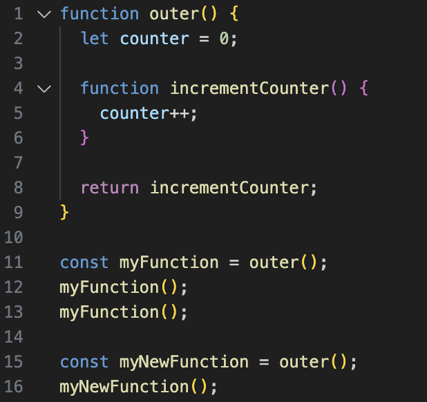

- [Execution Context](#execution-context)
- [Call Stack](#call-stack)
- [Closure](#closure)
- [Event Loop và Callback Queue](#event-loop-và-callback-queue)
- [Promise \& microtask queue trong JavaScript](#promise--microtask-queue-trong-javascript)

## Execution Context

Khi chương trình JavaScript được chạy, **global execution context** sẽ được khởi tạo, toàn bộ code ở global sẽ được thực thi trong context này. Khi gọi/ thực thi/ chạy một function, một **function execution context** tương ứng sẽ được tạo ra và các đoạn code của function đó sẽ được thực thi bên trong context này.

Execution Context có thể được hiểu như là một vùng chứa mà trong đó JavaScript engine theo dõi quá trình thực thi code, quản lý các variable và function.

Execution context gồm có 2 phần:

- **Thread of execution**: Đi qua từng dòng code và thực thi từng dòng.
- **Memory**: Lưu dữ liệu (variables) và code (function) để sử dụng.

### Hosting

Khi một execution context được khởi tạo, **hoisting** xảy ra. Hoisting là một cơ chế đặc biệt trong JavaScript, nơi mà các khai báo variable và function được "nâng/đẩy" lên đầu của scope hiện tại trước khi code thực sự được thực thi. Dễ hiểu thì nó là quá trình thiết lập memory space cho các variable và function.

#### Hoisting với `var`

Khi khai báo variable bằng `var`, biến được hoisted nhưng chỉ khởi tạo với giá trị undefined cho đến khi nó thực sự được gán giá trị trong quá trình thực thi.

```js
console.log(a); // undefined
var a = 5;
console.log(a); // 5
```

Trong ví dụ này, JavaScript engine hiểu code như sau:

```js
var a;
console.log(a); // undefined
a = 5;
console.log(a); // 5
```

Variable `a` được hoisted lên đầu, nhưng giá trị của nó chưa được gán ngay lập tức, dẫn đến kết quả `undefined` khi lần đầu tiên in ra `console.log(a);`.

#### Hoisting với `let` và `const`

Variable khai báo bằng `let` và `const` thì cũng được hoisted nhưng không được khởi tạo ngay lập tức. Thay vào đó, chúng nằm trong một temporal dead zone, và chỉ có thể được sử dụng sau khi đã được khai báo.

```js
console.log(b); // ReferenceError: Cannot access 'b' before initialization
let b = 10;
console.log(b); // 10
```

Với `let` và `const`, biến `b` được hoisted, nhưng việc truy cập nó trước khi khai báo sẽ dẫn đến lỗi `ReferenceError`. JavaScript engine vẫn biết về sự tồn tại của biến `b`, nhưng nó chỉ được khởi tạo khi thread of execution đi đến dòng code khai báo biến `b` và thực thi dòng code.

#### Hoisting với function

Hoisting cũng áp dụng cho các khai báo hàm (function declaration). Khi khai báo một hàm, toàn bộ định nghĩa của hàm được hoisted lên đầu phạm vi hiện tại, cho phép bạn gọi hàm trước khi nó xuất hiện trong mã.

```js
greet(); // "Hello!"
function greet() {
  console.log("Hello!");
}
```

Trong ví dụ này, func `greet` có thể được gọi trước khi định nghĩa của nó xuất hiện trong mã, bởi vì toàn bộ hàm đã được hoisted.

#### Hoisting với Function Expressions và Arrow Functions

Function expressions và arrow functions được xử lý như các variable, tức là chỉ có tên biến được hoisted, nhưng hàm không được khởi tạo cho đến khi thread of execution đi đến dòng code khai báo hàm.

```js
sayHello(); // TypeError: sayHello is not a function
var sayHello = function () {
  console.log("Hello!");
};
```

Trong trường hợp này, `sayHello` được hoisted giống như một variable khai báo bằng `var`, và giá trị ban đầu của nó là `undefined`. Khi cố gắng gọi nó trước khi được khởi tạo sẽ dẫn đến lỗi `TypeError`.

## Call Stack

JavaScript sử dụng một cơ chế gọi là **Call Stack** để quản lý các execution context - nó giúp theo dõi ta đang ở execution context nào - nghĩa là function nào đang được thực thi.

Khi chương trình bắt đầu, global execution context là context đầu tiên được đẩy vào call stack. Mỗi lần một hàm được gọi, một function execution context mới được tạo và đẩy lên đỉnh của call stack. Khi hàm hoàn thành, context của hàm đó sẽ được bật ra khỏi call stack, và JavaScript tiếp tục với context trước đó. Nó hoạt động theo cơ chế LIFO (last in first out).

Tạm thời lý thuyết là vậy, chúng ta sẽ hiểu vai trò của chúng sau khi xem qua ví dụ dưới đây.

### Tìm hiểu


Khi chúng ta chạy chương trình trên trên, một **global execution context** sẽ được tạo ra kèm **global memory**, trong call stack lúc này thì chúng ta đang ở **global()**.


Lúc này, **thread of execution** sẽ thực thi vai trò của nó là đi qua từng dòng code và thực thi lần luợt, như sau:

- **Dòng 1**: Khai báo một constant `num` ở global memory và gán giá trị cho nó là 3
- **Dòng 3**: Khai báo function multiplyBy2 ở global memory
- **Dòng 8**: Khai báo một constant `output` và giá trị của nó lúc này là chưa xác định, lý do? Vì ta gán cho nó `multiplyBy2(num)` - lúc này chưa xác định được giá trị.

Toàn cảnh tạm thời của ta đang có:


Ta giải quyết bằng cách gọi function `multiplyBy2` và truyền vào argument `num`. Giá trị của `num` là gì? Đi đến **global memory** để tìm và nhận được giá trị là `3`.
Sau đó tiến hành gọi function `multiplyBy2(3)`.

Như đã tìm hiểu ở phần lý thuyết, mỗi khi ta gọi một function thì một **function execution context** tương ứng sẽ được tạo ra để thực thi code của function đó.

Lúc này, `multiplyBy2(3)` cũng sẽ được đẩy vào call stack.


Lúc này ta đang ở function execution context của multiplyBy2(3), và thread of execution lại tiếp tục thực hiện nhiệm vụ của mình:

- Gán giá trị cho parameter `inputNumber`: 3
- Khai báo một constant `result` ở local memory và gán giá trị cho nó là: `3 * 2: 6`
- `return result;`
  - 1. JavaScript sẽ đi đến local memory và tìm giá trị của `result`: `6`.
  - 2. Lấy giá trị vừa tìm được và return (trả về) cho constant `output` ở global memory.


Vậy là đã hoàn thành, function execution context ở trên sẽ được cleared (xoá) - `multiplyBy2(3)` sẽ bị lấy ra khỏi call stack và ta trở lại **global().**


Thread of execution lại tiếp tục làm nhiệm vụ của mình, đi đến và thực thi dòng code tiếp theo.

- **Dòng 9**: Khai báo một constant `newOutput` và gán giá trị cho nó là `multiplyBy2(10)`. Tương tự như khi thực thi **Dòng 8** nên chúng ta sẽ đi nhanh hơn.
  - `multiplyBy2(10)` được đẩy vào call stack
  - Một function execution context tương ứng được tạo ra để thực thi.
  - Thực thi từng dòng, và trả giá trị đã tính toán được cho `newOutput` ở global memory


Do đã thực thi xong nên function execution context ở trên sẽ được xoá. Lúc này `multiplyBy2(10)` sẽ bị lấy ra khỏi stack và ta trở lại **global()**.


Vì chương trình đã hoàn thành nên global execution context cũng sẽ được cleared luôn.

## Closure

Closure là khi một function "**nhớ**" về lexical scope của nó, ngay cả khi nó được thực thi ở bên ngoài _lexical scope_ đó. Tạm thời cứ hiểu trừu tượng là thế, ngay dưới đây chúng ta sẽ tìm hiểu cách nó hoạt động thông qua ví dụ.

Ta sẽ tìm hiểu cách closure hoạt động, dựa trên chương trình sau:


Khi chương trình trên được chạy, JavaScript:

1. Khai báo function `outer` ở global memory
2. **Dòng 11** : `const myFunction = outer()`, khi gọi function `outer`, JavaScript sẽ:
   1. Đẩy `outer()` vào call stack
   2. Tạo một execution context tương ứng
   3. Khai báo biến `counter` và gán giá trị `0` cho nó ở local memory
   4. Khai báo function `incrementCounter` ở local memory
   5. return `incrementCounter` cho `myFunction` ở global memory


Sau khi đã thực thi xong, function execution context đó sẽ bị xoá, ở call stack thì `outer()` cũng sẽ bị lấy ra, trở lại global().

3. Lúc này thread of execution đi đến **dòng 12**, và thực thi: `myFunction();` <br> - Lúc này JavaScript đẩy `myFunction()` vào call stack và tạo một execution context tương ứng cho nó. <br> - Trong `myFunction`, ta thực thi `counter++`, nhưng tìm `counter` ở đâu?
   - Đầu tiên là tìm `counter` ở **local memory**. Không thấy
   - Chúng ta thực thi `myFunction` ở đâu? Global! Vậy tìm `counter` ở **global memory**, nhưng có `counter` nào ở global memory đâu?
   - 

Để biết phải tìm `counter` ở đâu, ta quay lại **dòng 11** một xíu.

Thật ra khi **dòng 11** được thực thi, ở bước cuối khi trả về (**return**) thì JavaScript không chỉ lưu code trong function `incrementCounter` vào `myFunction`, mà còn mang theo dữ liệu xung quanh (_lexical scope_) mà code trong function **có tham chiếu tới**.


Đây là lý do ở phần giới thiệu mình có nói:

> Closure là khi một function "**nhớ**" về _lexical scope_ của nó, ngay cả khi nó được thực thi ở ngoài _lexical scope_ đó.

Vậy giờ chỉ cần đến `myFunction` tìm `counter` và thực thi dòng code là tăng giá trị của `counter` từ `0` thành `1`.


Sau khi thực thi xong, function execution context này bị xoá (nếu local memory của nó có dữ liệu thì cũng bị xoá luôn), ở call stack thì `myFunction()` cũng sẽ bị lấy ra, trở lại `global()`.

4. Lúc này JavaScript tiếp tục thực thi **dòng 13**, tương tự như khi thực thi **dòng 12**, sau khi thực thi **dòng 13** thì giá trị của `counter` này là 2.
   

Hãy tưởng tượng chúng ta có một thuộc tính ẩn **[[scope]]** - liên kết đến tất cả dữ liệu xung quanh nơi khai báo `incrementCounter`.

Và nếu những dữ liệu đó được `incrementCounter` tham chiếu đến, chúng sẽ đi cùng với `myFunction` và chúng ta chỉ có thể truy cập những dữ liệu xung quanh đã được gửi đi chung này khi thực thi `myFunction`. Chúng ta gọi những dữ liệu xung quanh được gửi đi chung này là **backpack**.

5. Khi thực thi **dòng 15**, tương tự với **dòng 11**, JavaScript đẩy `outer() `vào call stack, một function execution context mới lại được tạo ra để thực thi `outer`.

Và vì nó hoàn toàn mới, local memory của nó cũng mới, nên khi JavaScript trả về (**return**) định nghĩa của function `incrementCounter` cho `myNewFunction` thì nó mang theo một **backpack** hoàn toàn mới, `counter` ở **backpack** này giá trị là `0`.


6. Tiếp theo JavaScript thực thi **dòng 16**, và khi cần tìm `counter` để thực thi, nó sẽ về global memory và tìm `counter` tại **backpack** ở `myNewfunction` và nâng giá trị của `counter` tại đây lên `1`.

Sau đó thì function execution context của `myNewFunction()` cũng sẽ bị xoá, và `myNewFunction()` sẽ được lấy ra khỏi call stack, call stack lúc này trở lại `global()`. Và chương trình đã hoàn thành nên global execution context cũng sẽ bị xoá.

Như vậy là ta đã tìm hiểu cách closure hoạt động. Cũng như tại sao function có thể nhớ về những dữ liệu xung quanh của nó.

## Event Loop và Callback Queue

JavaScript là một ngôn ngữ lập trình đơn luồng, nghĩa là chỉ có thể thực thi một câu lệnh tại một thời điểm. Đồng thời, nó có mô hình thực thi đồng bộ, trong đó các câu lệnh được chạy lần lượt theo thứ tự xuất hiện.

Tuy nhiên, trong nhiều tình huống, như chờ dữ liệu từ API, gửi yêu cầu đến server, hoặc đợi một bộ đếm thời gian (timer), chúng ta cần xử lý các tác vụ không đồng bộ. Vậy JavaScript giải quyết điều này như thế nào?

Trong phần trên của bài viết, ta đã tìm hiểu về core JavaScript engine, bao gồm:

- Thread of execution: Luồng thực thi của chương trình, chạy từng dòng code theo thứ tự.
- Memory/variable environment: Nơi lưu trữ dữ liệu như variable và function trong quá trình thực thi.
- Call stack: Ngăn xếp thực thi, nơi quản lý các execution context của các function.

Giờ đã có thêm 1 số thành phần mới:

- Web browser APIs/Node background APIs: Các API giúp thực hiện tác vụ như gọi HTTP request, timers mà không làm gián đoạn luồng chính.
- Event loop: Cơ chế giúp quản lý việc thực thi các tác vụ không đồng bộ, đảm bảo rằng Callback Queue và Microtask Queue được xử lý khi Call Stack trống.
  - Callback Queue: Nơi chứa các callback sẽ được thực thi khi một tác vụ không đồng bộ hoàn thành (ví dụ như `setTimeout`).

### Dẫn nhập

Ta có chương trình như sau:


Khi ta chạy chương trình, nó sẽ thực thi, lần lượt như sau:

**1**. **Dòng 1** - Khai báo function `printHello` ở global memory.


**2**. **Dòng 5** - Thực thi `setTimeout(printHello,1000)`. Lúc này nhiệm vụ được chuyển sang Web Browser Feature: **Timer**.

Nhưng ta đã gửi gắm gì cho **Timer**? Là `duration`: `1000ms` kèm theo `printHello`


Lúc này ta chuyển đến Web Browser Features và set một Timer cho việc này. Và vì lúc này là `1ms`, status của Timer chưa hoàn thành, nên ta sẽ trở lại global.


**3**. Trở lại với global, thread of execution đi tới và thực thi **dòng 7** - in ra `Me first!` - ở thời điểm `2ms`


**Lưu ý**: Khoảng thời gian qua, bộ đếm thời gian của Timer vẫn đang tíc tắc tíc tắc nhé.

**4**. Khi thời gian từ lúc bắt đầu chạy chương trình đạt `1000ms`, trạng thái của Timer được xác nhận hoàn thành và dựa trên On Completion, function `printHello` sẽ được đẩy vào Call stack và hàm `printHello` sẽ được thực thi, in ra `Hello`


### Tìm hiểu

JavaScript engine ưu tiên thế nào khi thực thi code?

- Code ở global sẽ được thực thi trước, theo thứ tự xuất hiện.
- Sau đó nó kiểm tra xem call stack có đang trống không? Nếu call stack trống, nó sẽ lấy code ra từ **callback queue** - nơi chúng ta thêm vào _callbacks function_.

Nghĩa là nếu global đã thực thi xong và call stack trống, JS engine sẽ đi đến **callbacks queue** để lấy _callback function_ và đẩy vào call stack để thực thi.

Nhưng ai - cái gì, đi kiểm tra và quản lý toàn bộ quá trình này? **`Event loop`**!

**Event loop**, là tính năng mà:

- Đi kiểm tra xem global còn code không? Nếu còn thì thực thi nó.
- Kiểm tra xem call stack có gì không? Nếu có thì thực thi nó.
- Nếu tất cả đã thực thi xong, chuyển tới callback queue và bắt đầu từ cái cũ nhất - lấy nó và thêm vào call stack để thực thi.

Quay trở lại với chương trình ở trên

Ở `1ms` `printHello` sẽ được đẩy vào **callback queue**, sau đó chương trình thực thi bình thường. Khi thời gian từ lúc bắt đầu chạy chương trình đạt `1000ms`:

- `printHello`: Ê tao hết thời gian bị hoãn rồi, cho tao trở lại đi.
- `Event loop`: Uh rồi, biết mày được phép trở lại rồi, để tao coi coi tới lượt mày chưa.

Sau đó `event loop` làm nhiệm vụ của nó là kiểm tra global execution context đã thực thi tất cả code ở global chưa, và xem call stack có đang trống hay không. Nếu các điều kiện trên thoả mãn thì nó sẽ đi đến `callback queue` và lấy `printHello` ra và đẩy vào call stack.


Nhưng nếu ở ví dụ trên, tại thời điểm `1000ms` mà 2 điều kiện trên chưa thoả mãn thì sao? Bạn sẽ có câu trả lời sau khi xem qua ví dụ dưới đây:


_Đến giờ mình giả định là bạn đã hiểu thread of execution, execution context, call stack nên mình sẽ đi nhanh hơn mà không đi từng bước cách chương trình được JS engine thực thi nữa. Nếu bạn chưa hiểu thì đọc lại phần trước nhé._

**1**. Tại thời điểm `1ms` **dòng 9** được thực thi - `setTimeout(printHello,0)`.

Ta đã gửi gắm gì cho Timer? Là duration: `0ms` kèm theo `printHello`.

Lúc này ta chuyển đến Web Browser Features và set một Timer cho việc này, Lúc này là `1ms`, duration là 0ms, status của Timer đã hoàn thành, vậy ta có đưa `printHello` về call stack và thực thi nó luôn không? Không!

Hãy nhớ lại ở phần event loop, ta có nói chỉ khi thoả các điều kiện sau thì mới tới lượt code trong callback queue được chạy:

- Global execution context đã thực thi xong hết code ở global
- Call stack đang trống

Ngay lúc này ở global vẫn còn code chưa được thực thi, nên _event loop_ sẽ chưa xem tới callback queue. Toàn cảnh lúc này đang là:


**2**. Với 1 trong 2 điều kiện chưa thoả mãn, ta quay lại global - lúc này đang là `2ms`, thực thi **dòng 11** đẩy `blockFor1Sec()` vào call stack. Function này làm gì kệ nó, cứ giả định là nó sẽ tốn của chúng ta `1s` hay `1000ms`.


**3**. Sau khi thực thi xong, JS engine lại trở về global và tiếp tục thực thi. Lúc này đang là `1002ms`, call stack đã trống. Nhưng ở global vẫn còn code để thực thi!

Đến **dòng 13** và thực thi, in ra `Me first!`


**4**. Lúc này, code ở global đã thực thi xong hết, call stack cũng trống, đã thoả điều kiện để `event loop` đi gặp `callback queue` và kiểm tra xem `callback queue` có cần gì không. Và vì có `printHello` đã đợi từ lâu, nó được đẩy vào call stack và thực thi, in ra `Hello`


Lúc này chương trình đã thực thi xong nên global execution context sẽ bị xoá.

## Promise & microtask queue trong JavaScript

Promise là một special object được tích hợp trong JavaScript. Promise đóng vai trò là một _placeholder_ cho dữ liệu chúng ta mong muốn nhận lại được từ hoạt động nền của web browser feature. Trong JavaScript, Promise được dùng để xử lý những vấn đề liên quan đến bất đồng bộ (asynchronous) một cách... đồng bộ (synchronous) hơn.

Một promise sẽ có một trong 3 trạng thái:

- `pending`: mới khởi tạo - chờ xử lý
- `fulfilled`: thành công hoàn thành thao tác xử lý
- `rejected`: thao tác xử lý thất bại hay xảy ra lỗi

Trong `promise object`, ta có 2 properties: `value` và `onFulfilled`

Do chúng ta không biết khi nào dữ liệu chúng ta cần sẽ có nên ta cần `then` để xử lý khi dữ liệu được trả về cho chúng ta, dữ liệu được trả về từ web browser API/ feature sẽ được lưu trong property `value`.

Property `onFulfilled` là một array trống - ta có thể thêm vào đó bất kỳ functions, bất kỳ codes nào mà chúng ta muốn tự động kích hoạt để thực thi với sự trợ giúp của JavaScript khi property `value` được điền vào.

Functions/codes nào được gắn vào property `onFulfilled` promise object thông qua method `then`, sẽ được tự động thực thi nếu như property `value` của promise object đó được cập nhật.

Ở phần event loop, ta biết callback function sẽ được thêm vào callback queue để chờ được thực thi. Với `promise` - ta đưa `deffered functions` vào **microtask queue**.

Nói lý thuyết vậy thôi, giờ ta đi vào ví dụ, ta có chương trình sau:


Khi chương trình được chạy, nó sẽ thực thi, lần lượt như sau:

1. Khai báo 3 function: `display`, `printHello`, `blockFor300ms` ở global memory


2. Tại thời điểm `1ms` - thực thi **dòng 12** - `setTimeout(printHello,0)`

`Timer` được set, và lúc này tại thời điểm `1ms` thì trạng thái của Timer cũng đã hoàn thành, ta có đẩy `printHello` vào call stack và thực thi không? Không!


Lúc này chưa thoả điều kiện để xem đến callback queue, nên ta sẽ trở lại global.

3. Tại thời điểm `2ms` - thực thi **dòng 15**

Khai báo constant `futureData` với method `fetch`

Method `fetch` này vừa chơi với JavaScript, vừa chơi với Web Browser.

- Trong JavaScript: tạo một promise object với 2 properties: `value` và `onFulfilled`
- Với Web Browser: set một network request

Tại thời điểm này, 2 properties của promise object đều đang trống, trạng thái của promise object là `pending`. Với web browser thì network request chưa hoàn thành ở thời điểm `2ms`, nên on completion của chúng ta là trả về dữ liệu cho `futureData.value` chưa được thực thi.


4. Trở về global và thực thi dòng 17 - `futureData.then(display)`

Function `display` được thêm vào property `onFulfilled` của promise object `futureData`, ở **global memory**.


Ta lại trở về global

5. Tiếp theo, tại thời điểm `3ms` - **dòng 19** - function `blockFor300ms` được thực thi

Sau khi `blockFor300ms` được thực thi xong, lúc này thời gian từ lúc thực thi đang là `303ms`.

Lưu ý, nãy giờ bộ đếm thời gian vẫn hoạt động, và lúc `270ms` - ở network request, trạng thái đã trở thành hoàn thành - promise object `futureData` lúc này đang ở trạng thái `fulfilled` và property `value` của futureData đã được cập nhật,


display cũng đã được thêm vào microtask queue.


Như ở phần lý thuyết trên, chúng ta có nói:

> Functions/codes nào được gắn vào property `onFulfilled` của promise object thông qua method `then`, sẽ được tự động thực thi nếu như property `value` của promise object đó được cập nhật.

Lúc này, property `value` của `futureData` đã được cập nhật, function `display` cũng được thêm vào microtask queue rồi. Vậy tại sao function `display` vẫn chưa được thực thi?

Vì function `display` đang nằm trong microtask queue. Cũng giống _call back queue_, `microtask queue` chỉ được xem tới nếu như **event loop** xác nhận:

- Ở global: code đã được thực thi hết
- Ở call stack: trống

Vậy thì giữa microtask queue và callback queue thì event loop ưu tiên đến queue nào? Đáp án là **microtask queue**!

Chỉ khi nào microtask queue và call stack đang trống, và code ở global đã thực thi xong hết thì _event loop_ mới ghé đến callback queue và kiểm tra có gì trong đó đang đợi để được thực thi không.

Và tại vì ở global vẫn còn code, nên microtask queue chưa được xem tới, `display` chưa được thực thi, ta trở về global.

6. Tại thời điểm `303ms` - Thực thi dòng 21 - in ra `Me first!`
7. Ai làm việc người ấy, _event loop_ thì vẫn miệt mài xem call stack có trống hay không, ở global đã thực thi xong hết code chưa.

Và vì call stack đang trống, global đã hết code. Nó tiến đến kiểm tra microtask queue, tại đây event loop thấy function `display`.

Tại thời điểm `304ms`: function `display` được lấy ra khỏi microtask queue và được đẩy vào callstack để thực thi - in ra `Hi`

8. Sau khi thấy microtask queue đã trống, event loop đi đến kiểm tra callback queue, và thấy function `printHello` ở đây.

Tại thời điểm `305ms`: function `printHello` được lấy ra khỏi callback queue và được đẩy vào callstack và thực thi - in ra `Hello`


Lúc này chương trình đã thực thi xong nên global execution context sẽ bị xoá.

Vậy là ta đã tìm hiểu về Execution Context, Call Stack, Event Loop, Queue và Promise trong JavaScript. Hy vọng bài viết giúp bạn hiểu rõ hơn về cách JavaScript hoạt động.
