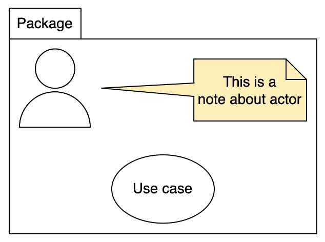
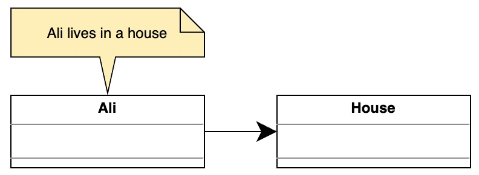
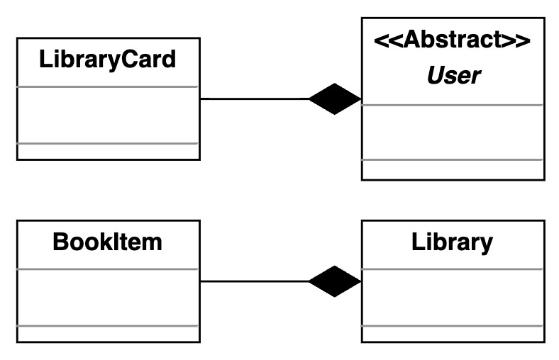

This repository contains my notes of [Grokking the Low Level Design Interview Using OOD Principles
](https://www.educative.io/courses/grokking-the-low-level-design-interview-using-ood-principles) course on [Educative](https://www.educative.io/), use for my own reference.

- [Introduction to the Unified Modeling Language](#introduction-to-the-unified-modeling-language)
  - [What is UML?](#what-is-uml)
  - [UML basic notations](#uml-basic-notations)
    - [Things](#things)
      - [Structural things](#structural-things)
      - [Behavioral things](#behavioral-things)
- [UML Diagrams](#uml-diagrams)
  - [Types of UML Diagrams](#types-of-uml-diagrams)
    - [Structural UML diagrams](#structural-uml-diagrams)
    - [Behavioral UML diagrams](#behavioral-uml-diagrams)
  - [Use Case Diagram](#use-case-diagram)
    - [Components of a use case diagram](#components-of-a-use-case-diagram)
    - [Relationships in use case diagrams](#relationships-in-use-case-diagrams)
  - [Class Diagram](#class-diagram)
    - [Why use class diagrams?](#why-use-class-diagrams)
    - [Popular notations in the class diagram](#popular-notations-in-the-class-diagram)
      - [Class notation](#class-notation)
      - [Interface, abstract class, and enumeration](#interface-abstract-class-and-enumeration)
      - [Access modifiers](#access-modifiers)
    - [Association](#association)
      - [Class association](#class-association)
      - [Object association](#object-association)
        - [Simple association](#simple-association)
        - [Aggregation](#aggregation)
        - [Composition](#composition)
        - [Some additional types of association](#some-additional-types-of-association)
    - [Dependency](#dependency)
  - [Sequence Diagram](#sequence-diagram)
    - [Elements of a sequence diagram](#elements-of-a-sequence-diagram)
      - [Lifeline](#lifeline)
      - [Activation bars](#activation-bars)
      - [Messages](#messages)
    - [How to draw a sequence diagram](#how-to-draw-a-sequence-diagram)
      - [Identify the use case](#identify-the-use-case)
      - [Identify the actors and objects](#identify-the-actors-and-objects)
      - [Identify the order of actions](#identify-the-order-of-actions)
      - [Create the diagram](#create-the-diagram)
    - [Fragment frame in the sequence diagram](#fragment-frame-in-the-sequence-diagram)
  - [Activity Diagram](#activity-diagram)
    - [Purpose of activity diagram](#purpose-of-activity-diagram)
    - [Components of an activity diagram](#components-of-an-activity-diagram)
    - [How to draw an activity diagram](#how-to-draw-an-activity-diagram)
      - [Determine the actions of the system](#determine-the-actions-of-the-system)
      - [Finding the flow of each activity](#finding-the-flow-of-each-activity)
      - [Create the diagram](#create-the-diagram-1)
    - [Sequence vs. activity diagram](#sequence-vs-activity-diagram)
- [Object-oriented Design Principles](#object-oriented-design-principles)
  - [Introduction to SOLID Design Principles](#introduction-to-solid-design-principles)
    - [Design principles](#design-principles)
  - [Single Responsibility Principle](#single-responsibility-principle)
    - [Introduction](#introduction)
    - [Real-life example](#real-life-example)
    - [Book invoice application](#book-invoice-application)
      - [Violations](#violations)
    - [Conclusion](#conclusion)
  - [Open-Closed Principle](#open-closed-principle)
    - [Introduction](#introduction-1)
    - [Example](#example)
      - [Implementing the Open Closed Principle](#implementing-the-open-closed-principle)
    - [Conclusion](#conclusion-1)
  - [Liskov Substitution Principle](#liskov-substitution-principle)
    - [Introduction](#introduction-2)
    - [The Vehicle class](#the-vehicle-class)
      - [Violation](#violation)
      - [Solution](#solution)
    - [Conclusion](#conclusion-2)
  - [Interface Segregation Principle](#interface-segregation-principle)
    - [Introduction](#introduction-3)
    - [Example](#example-1)
      - [Violation](#violation-1)
      - [Solution](#solution-1)
    - [Conclusion](#conclusion-3)
  - [Dependency Inversion Principle](#dependency-inversion-principle)
    - [Introduction](#introduction-4)
    - [Real-life example](#real-life-example-1)
      - [Violation](#violation-2)
      - [Solution](#solution-2)
    - [Conclusion](#conclusion-4)
- [Design Patterns](#design-patterns)
  - [Introduction to the Design Patterns](#introduction-to-the-design-patterns)
    - [What are design patterns?](#what-are-design-patterns)
    - [Structure of design patterns](#structure-of-design-patterns)
    - [Advantages of design patterns](#advantages-of-design-patterns)
    - [Consequences of unfamiliarity with the design patterns](#consequences-of-unfamiliarity-with-the-design-patterns)
  - [Classification of Design Patterns](#classification-of-design-patterns)
    - [Creational design patterns](#creational-design-patterns)
    - [Structural design patterns](#structural-design-patterns)
    - [Behavioral design patterns](#behavioral-design-patterns)
    - [Architectural design patterns](#architectural-design-patterns)
  - [Creational Design Patterns](#creational-design-patterns-1)
    - [Introduction to creational design patterns](#introduction-to-creational-design-patterns)
      - [Factory pattern](#factory-pattern)
      - [Constructor pattern](#constructor-pattern)
      - [Singleton pattern](#singleton-pattern)
      - [Builder pattern](#builder-pattern)
      - [Prototype pattern](#prototype-pattern)
      - [Abstract pattern](#abstract-pattern)
  - [Structural Design Patterns](#structural-design-patterns-1)
    - [Introduction to structural patterns](#introduction-to-structural-patterns)
    - [Decorator pattern](#decorator-pattern)
    - [Facade pattern](#facade-pattern)
    - [Adapter pattern](#adapter-pattern)
    - [Bridge pattern](#bridge-pattern)
    - [Composite pattern](#composite-pattern)
    - [Flyweight pattern](#flyweight-pattern)
    - [Proxy pattern](#proxy-pattern)
    - [When to use structural patterns?](#when-to-use-structural-patterns)
  - [Behavioral Design Patterns](#behavioral-design-patterns-1)
    - [What are behavioral patterns?](#what-are-behavioral-patterns)
    - [Chain of Responsibility pattern](#chain-of-responsibility-pattern)
    - [Command pattern](#command-pattern)
    - [Iterator pattern](#iterator-pattern)
    - [Mediator pattern](#mediator-pattern)
    - [Observer pattern](#observer-pattern)
    - [Visitor pattern](#visitor-pattern)
- [An Approach to Solve a Real-world Problem](#an-approach-to-solve-a-real-world-problem)
  - [Interview process](#interview-process)
    - [Identify the requirements](#identify-the-requirements)
    - [Model the problem](#model-the-problem)
    - [Establish the classes and their relationships](#establish-the-classes-and-their-relationships)
    - [Sequence and activity diagrams](#sequence-and-activity-diagrams)
    - [Use design patterns](#use-design-patterns)
    - [Code](#code)
  - [Design approach](#design-approach)
    - [Top-down vs. bottom-up approach](#top-down-vs-bottom-up-approach)
- [Library Management System](#library-management-system)
  - [Getting Ready: Library Management System](#getting-ready-library-management-system)
    - [Problem definition](#problem-definition)
    - [Expectations from the interviewee](#expectations-from-the-interviewee)
      - [Efficient searching](#efficient-searching)
      - [Versatility](#versatility)
      - [Book reservation](#book-reservation)
      - [Book renewal](#book-renewal)
      - [Fine management](#fine-management)
    - [Design approach](#design-approach-1)
    - [Design pattern](#design-pattern)
  - [Requirements for the Library Management System](#requirements-for-the-library-management-system)
    - [Requirement collection](#requirement-collection)
  - [Use Case Diagram for the Library Management System](#use-case-diagram-for-the-library-management-system)
    - [System](#system)
    - [Actors](#actors)
      - [Primary actors](#primary-actors)
      - [Secondary actors](#secondary-actors)
    - [Use cases](#use-cases)
      - [Librarian](#librarian)
      - [Member](#member)
      - [System](#system-1)
    - [Relationships](#relationships)
      - [Generalization](#generalization)
      - [Associations](#associations)
      - [Include](#include)
      - [Extend](#extend)
    - [Use case diagram](#use-case-diagram-1)
  - [Class Diagram for the Library Management System](#class-diagram-for-the-library-management-system)
    - [Components of a library management system](#components-of-a-library-management-system)
      - [Book and book item](#book-and-book-item)
      - [Rack](#rack)
      - [Person and author](#person-and-author)
      - [User, librarian, and library member](#user-librarian-and-library-member)
      - [Library card](#library-card)
      - [Book reservation](#book-reservation-1)
      - [Book lending](#book-lending)
      - [Notification](#notification)
      - [Search and catalog](#search-and-catalog)
      - [Library](#library)
      - [Enumerations](#enumerations)
      - [Custom data type](#custom-data-type)
    - [Relationship between the classes](#relationship-between-the-classes)
      - [Association](#association-1)
        - [One-way association](#one-way-association)
        - [Two-way association](#two-way-association)
      - [Composition](#composition-1)
      - [Aggregation](#aggregation-1)
      - [Inheritance](#inheritance)
    - [Class diagram of the library management system](#class-diagram-of-the-library-management-system)
    - [Design pattern](#design-pattern-1)
    - [Additional requirements](#additional-requirements)
  - [Sequence Diagram for the Library Management System](#sequence-diagram-for-the-library-management-system)
    - [Issue a book](#issue-a-book)
    - [Return a book](#return-a-book)
  - [Activity Diagram for the Library Management System](#activity-diagram-for-the-library-management-system)
    - [Check out a book from the library](#check-out-a-book-from-the-library)
      - [States](#states)
      - [Actions](#actions)
    - [Return a book to the library](#return-a-book-to-the-library)
      - [States](#states-1)
      - [Actions](#actions-1)
    - [Renew a book from the library](#renew-a-book-from-the-library)
  - [Code of Library Management System](#code-of-library-management-system)
    - [Library management](#library-management)
      - [Enumerations](#enumerations-1)
        - [C#](#c)
        - [C++](#c-1)
        - [Python](#python)
      - [Address and person](#address-and-person)
        - [C#](#c-2)
        - [C++](#c-3)
        - [Python](#python-1)
      - [User](#user)
        - [C](#c-4)
        - [C++](#c-5)
        - [Python](#python-2)
      - [Book reservation, book lending and fine](#book-reservation-book-lending-and-fine)
        - [C](#c-6)
        - [C++](#c-7)
        - [Python](#python-3)
      - [Book and rack](#book-and-rack)
        - [C](#c-8)
        - [C++](#c-9)
        - [Python](#python-4)
      - [Notification](#notification-1)
        - [C](#c-10)
        - [C++](#c-11)
        - [Python](#python-5)
      - [Search and catalog](#search-and-catalog-1)
        - [C](#c-12)
        - [C++](#c-13)
        - [Python](#python-6)
      - [Library](#library-1)
        - [C](#c-14)
        - [C++](#c-15)
        - [Python](#python-7)

# Introduction to the Unified Modeling Language

## What is UML?

UML is not a programming language but is used to visualize a system’s behavior and structure. It is known for providing tools to software engineers and developers that allow them to analyze, design, and develop software systems and model processes. UML is the perfect language to explain the inner workings of the software system to all the stakeholders involved—from an analyst to an author.

## UML basic notations

UML is composed of three main building blocks: **things**, **relationships**, and **diagrams**. These three exist at the center of UML and play a key role in producing effective and easily understandable models.

### Things

#### Structural things

The structural things represent a system's physical aspects, such as a class, object, interface, use case, actor, component, and node. A description of these is provided below:

1. Class: The notation represents the attributes and methods of an object.

   

2. Object: This notation refers to the instance of a class.

   

3. Interface: This notation represents the functionality without its implementation.

   

4. Use case: This notation describes the users’ goals and possible interactions with the system.

   

5. Actor: This notation represents the entities interacting with the system.

   

6. Component: This notation represents a section of the system.

   

7. Node: This notation is similar to the component notation, with the difference being that the node notation refers to the physical aspect of a system, such as a server.

   

#### Behavioral things

The behavioral things represent the various system's interactions and functions, such as state machines, activity, and interaction diagrams. The explanation of these behavioral things is given below:

1. Activity diagrams: These describe the various interactions performed by different components present in the system.

   

2. Interaction diagrams: These diagrams describe the message flow between the different components present in the system.

   

# UML Diagrams

## Types of UML Diagrams

UML diagrams can be classified into two categories:

- Structural UML diagrams
- Behavioral UML diagrams

The following illustration represents the subcategories of structural and behavioral UML diagrams:


### Structural UML diagrams

Structural diagrams represent the static structure of the system. They never depict the system’s dynamic behavior. The most commonly used structural diagram in software development is the _class diagram_.

### Behavioral UML diagrams

Behavioral diagrams represent the dynamic behavior of elements in the system. All systems experience dynamic occurrences. In object-oriented programming, we use behavioral diagrams to illustrate the dynamic behavioral semantics of a problem or its implementation. The most commonly used behavioral diagrams are _use case diagrams_, _activity diagrams_, and _sequence diagrams_.

## Use Case Diagram

Use case diagram describes the specification of users and their possible interactions with the system. These possible interactions are called use cases.

### Components of a use case diagram

To understand a use case diagram, it is important to first understand its components. Use case diagrams have the following components:

- **Actor**: Users are called actors. They interact with the system. They could be humans, machines/hardware, or other external systems. There are two types of actors:
  - **Primary actors**: These are the humans or external systems that interact with that system and are responsible for initiating the use case. They are placed on the left side in a use case diagram. Primary actors are also called active actors.
  - **Secondary actor**s: These are the ones that are used by the system to assist the primary actors in a use case. They cannot interact with the system on their own. They need primary actors to initiate a use case. Secondary actors are also called passive actors, and they are placed on the right side in a use case diagram.
- **Use case**: This is a single function performed on a system by an actor. It is represented by an oval shape.
- **Package**: This is a group of different elements. These groups are represented inside a folder icon.
- **Note**: This is used to add additional information about any component or relationship in a use case diagram.



> Components of a use case diagram

### Relationships in use case diagrams

There are four different types of relationships in a use case diagram:

1. **Association**: This shows the relationship between and among actor(s) and use case(s). It represents how an actor can perform certain functions. It is denoted by a solid line without arrows. All the actors in a use case diagram must have at least one association with any use case. More than one actor can be associated with the same use case, and a single actor can be associated with more than one use case.

2. **Generalization**: This relationship is also known as inheritance. In inheritance, we have parent and children classes. Similarly, in a use case diagram, we have parent and child use cases. The child use case has generalization with the parent use case. Each child inherits the behavior of its parent. It is denoted by a solid line with an arrow on only one side (toward the parent use case).

3. **Include**: We use this to show the relationship between two use cases. It shows that one use case includes the behavior of another use case. The included use case will execute only after the execution of the base use case. We can also say that the base use case requires an included use case in order to be completed. It is represented by a dashed line with an arrow on only one side (toward the included use case), and we write `<<include>>` above the line.

4. **Extend**: We use this to show the relationship between two use cases. It shows that one use case extends the behaviors of another use case. The extended use case does not execute every time. It always depends on certain conditions. It is used to extend the functionality of the base use case. It is represented by a dashed line with an arrow on only one side (toward the base use case), and we write `<<extend>>` above the line.

In the example below, we have a small ATM (automated teller machine) transaction system where customers can transfer funds and make payments. To validate the funds, the transfer system has to check if a sufficient amount of funds is available. Otherwise, an error message will be displayed. To make a payment, a customer has two choices. It can either pay via a current account or a savings account.


> The use case diagram of an ATM

## Class Diagram

**Class diagrams** are used to depict the system's static perspective. They are used in the design process to show the shared roles and responsibilities of the entities that produce the behavior of the system.

Class diagrams are widely used in the modeling of object-oriented designs because this is the only UML diagram that can be directly transferred to object-oriented programming languages.

### Why use class diagrams?

- Represents the system's static structure.
- Directly maps with object-oriented languages.
- Represents what the system's duties or responsibilities are.
- Uses in both forward and reverse engineering.

### Popular notations in the class diagram

- Class notation
- Interface, abstract class, and enumeration
- Access modifiers

#### Class notation

A class is represented by a rectangle with three sections. The first section holds the class **name**, the second one lists the **attributes**, and the third one shows the **methods** (operations). The following is the depiction of a `Movie` class with its attributes and methods.


#### Interface, abstract class, and enumeration

We can declare a class as _abstract_ using **abstract** keywords. The class name will be printed in italic. We can use the interface, annotation, and enum keywords too. The illustration below shows how to depict these notations in a class diagram.


#### Access modifiers

You may use character symbols to specify the visibility of the associated object when defining methods or attributes. The most widely used access modifiers are as follows:

**Public**: A public member can be seen anywhere in the system. It is represented by a `+` symbol.

**Private**: Members can only be accessible from within the class. It is inaccessible from outside the class. It is represented by a `-` symbol.

**Protected**: Members are only accessible within the class and derived classes. It is represented by the `#` symbol.

The following images show how to use the access modifiers in the class diagram:


### Association

**Association** provides a mechanism to communicate one object with another object, or one object provides services to another object. Association represents the relationship between classes.

The association can be divided into two categories:

- Class association (Inheritance)
- Object association


#### Class association

**Inheritance** falls under the category of class association. Creating a new class from the existing class(es) is called **inheritance**. Apart from its own behaviors and attributes, the child class inherits the characteristics of its parent(s). A solid line leads from the child class to the parent class with a hollow arrowhead representing the inheritance relationship.

The following class diagram represents the inheritance relationship:


#### Object association

Object association (relationship between objects) can be divided into the following categories:

1. Simple association
2. Composition
3. Aggregation

##### Simple association

The weakest connections between objects are made through **simple association**. It is achieved through reference, which one object can inherit from another. The following is an example of a simple association:


##### Aggregation

**Aggregation** describes the relationship between the container and the object it contains. An object may contain an aggregate of another object. Aggregation is denoted by a line with an unfilled diamond head towards the container.

Aggregation is a _weaker_ relationship because:

- Aggregate objects are not a part of the container.
- Aggregate objects can exist independently.


##### Composition

An object may be composed of smaller objects, and the relationship between the “part” objects and “whole” objects is known as **composition**.

In the example below, the `Chair` class can be composed of other objects of `Arm`, `Seat`, and `Leg` types. Composition is denoted by a line with a filled diamond head at the composer class pointing to the component class.

Composition is a _strong_ relationship because:

- The composed object becomes a part of the composer.
- Composed objects can not exist independently.


##### Some additional types of association

The following are some types of simple associations based on navigation:

- Single-direction navigation is called **one-way association** and is denoted by an arrow toward the server object.
  

- If we navigate in both directions, the association is called a **two-way association** and is denoted by a line between two objects.
  

- Binary, ternary, and n-ary associations are based on the number of objects.
  - Association in which two objects are involved is called a **binary association**. The binary association includes one-way or two-way navigation.
  - Association between the objects of exactly three classes is a **ternary association** and is denoted by a diamond with lines connected to associated objects.
  - Association between more than three classes is called **n-ary** association.
    

### Dependency

**Dependency** indicates that one class is dependent on another class(es) for its implementation. Another class may or may not depend on the first class. A dashed arrow denotes dependency.


In the example above, we have two classes—`RegistrationManager` and `Student`. The `RegistrationManager` class relies on the `Student` class for its behavior because the object of the `Student` class is passed as a parameter to one of the functions in the `RegistrationManager` class.

## Sequence Diagram

A **sequence diagram** is a form of communication diagram that illustrates how different actors and objects interact with each other or between themselves. The diagram represents these interactions as an exchange of messages between various entities and the type of exchange. Sequence diagrams also demonstrate the sequence of events that occur in a specific use case and the logic behind different operations and functions.

### Elements of a sequence diagram

Various elements make up a sequence diagram. Let's discuss some of the essential elements of this diagram that appear most often.

#### Lifeline

In sequence diagrams, we write all entities horizontally. Each entity has a **lifeline** that represents its existence, i.e., when the entity is activated or deactivated. We illustrate this using a dotted line below the entity. We represent different objects, actors, entities, or boundaries in a system using lifelines, and they never overlap each other. The illustration below shows how to visualize a lifeline in UML. The horizontal boxes are used to denote the objects involved in the interaction.


#### Activation bars

Activation bars indicate the active period of an object, that is, the time when an object sends or receives messages. We draw these using simple vertical boxes on the lifeline. Here's an example of an activation bar:


#### Messages

In sequence diagrams, a message is an interaction between two objects. It can be in the form of sending and receiving messages, invoking an operation, or creating a new object or entity. Messages are drawn horizontally in any direction: left to right, right to left, or back to themselves. Different kinds of messages are represented using different arrows. Let's look at the types of messages:

1. A **synchronous message** is a type of message where the sender has to wait for the receiver to return a response before it can perform another operation. We can draw synchronous messages using a solid line with a filled arrowhead.


2. An **asynchronous message** is a type of message where the sender does not have to wait for a response from the receiver. The sender can continue sending messages to other objects. We can draw the asynchronous messages using a solid line with an open arrowhead.


3. A **synchronous return** is a type of message generated in response to a synchronous call. A synchronous message has to be paired with a synchronous return message. It means that the receiver has processed the message and sent a response. We can draw synchronous return messages using a dotted line with a filled arrowhead.


4. A **create message** indicates that a new object is created during an interaction. New objects can be created as a result of some message or operation. We can draw it like this:


5. A **destroy message** indicates that an object is destroyed during a sequence of events. Objects can be destroyed as a result of some message or operation, and their lifeline ends. We can draw it like this:


6. A **lost message** is a message that initiates from an object but does not reach its endpoint. It appears as a message that is terminated. A **found message** is a message that is received, but the sender is unknown. It appears as a message that reaches an endpoint but does not initiate from any object. We draw lost messages as an arrow ending with a circle and found messages with an arrow starting with a circle.


> Note: Some sequence diagrams use filled circles to represent the lost and found messages.

### How to draw a sequence diagram

To create a self-explanatory sequence diagram, there are a number of steps that we need to follow. Before we start, it is important to understand that there isn't one correct way of creating a sequence diagram. Some of us may have a different approach to handling these problems.

#### Identify the use case

To get started with the sequence diagram, it is essential to know our use case. The sequence diagram is a means to define the sequential order of events that occur in that use case.

Let's build on a simple scenario where a customer wants to withdraw cash from an ATM. Our use case will be as follows:


#### Identify the actors and objects

Now, we need to list down all the actors and objects that will be involved in the entire sequence. These would be the following:

- Customer
- ATM
- Transaction
- Account
- Cash dispenser

#### Identify the order of actions

We have identified the entities involved in the cash withdrawal sequence, but we don't know how these entities will interact with each other. It is important that we note down the action and the order in which they will occur. Here's how we can define the interaction in steps:

1. The customer requests a cash withdrawal from the ATM with their account information and the amount.

2. The ATM initiates a cash withdrawal transaction against the account and the given amount.

3. The transaction amount is verified for the given account.

4. In case the amount entered is valid, the account verifies the transaction.

5. The ATM signals the cash dispenser to release the required cash amount.

6. The cash dispenser confirms the release of cash.

7. The ATM prompts the user to collect the cash.

#### Create the diagram

We have identified all the involved objects and entities in the interaction. We have also listed down the order in which the objects will perform these actions. To finally create the sequence diagram, we need to relate these steps with the type of messages that the objects will exchange with each other. Here's a possible diagram that we can create for the cash withdrawal scenario:


### Fragment frame in the sequence diagram

Our goal is to keep our sequence diagram as simple as possible without clutter and information overload. However, sometimes we need to show more complex actions like conditional actions or loop sequences. Sequence diagrams allow us to represent this information using the sequence fragment component. We can identify the operator of a fragment in the top left corner of the fragment frame. Here are a few examples of fragment operators:

- **Alternative (alt)**: This operator models the if-else condition. It divides the fragment into parts, and either of the parts can take place based on the guard condition.

- **Option (opt)**: This operator models the if condition. The fragment will only execute if the guard condition is met. Otherwise, the entire fragment is skipped, and the interaction continues.

- **Loop (loop)**: This operator represents a repetitive sequence. The fragment will keep repeating until the guard condition is met.

- **Reference (ref)**: This operator assists in managing larger diagrams. It allows us to reuse parts of another sequence diagram by providing a reference to it.

Let's expand the sequence diagram we created to see how we can build on it further using a sequence fragment.


In the diagram above, we add the alternatives operator, which divides the sequence into two fragments. The first fragment takes place if the guard condition is met, while in any other case, the second fragment occurs. Here the guard condition is that the balance in the account should be greater than or equal to the amount requested by the customer.

## Activity Diagram

An **activity diagram** is a communication diagram that is used to show the dynamic aspects performed by a system. This diagram is used to represent a series of actions, similar to how they may appear in a flowchart.

### Purpose of activity diagram

Much like the previously discussed UML diagrams, activity diagrams are also used to show the sequence through which events occur in the system. Activity diagrams differ from other UML diagrams in that they specifically capture the message flow for each activity on to the next. These may look like flowcharts in appearance, but in execution, they can be much more. They can show various flows, such as single, parallel, concurrent, and branched.

### Components of an activity diagram

Various components make up an activity diagram. Let's discuss some of the essential features of this diagram that appear most often.

**Initial**: This represents the start of the workflow of the activity diagram. They can be visualized as the node in a tree structure.


**Action**: These are the main building blocks of an activity diagram and are used to show the activities that a modeled process is made of.


**Flow final**: This represents the end of a single path in the activity diagram. They can be visualized as a leaf in a tree structure.


**Activity final**: This represents the end of all the activities in the activity diagram.


**Control flow**: This shows the directional flow of the diagram. This exists as a connector between one action ande another.


**Object flow**: This shows the path of the objects as they move throughout the activity.


**Decision**: This is used to represent multiple options that are possible in a system. They appear as a branch alongside the text describing the condition for the path.


**Merge**: This uses the same symbol as a decision. However, this shows that multiple options join at this node, but leads to a single output.


**Fork and join**: The fork node represents a single activity that is split into two concurrent activities happening alongside each other. On the other hand, the join node joins two concurrent activities together to lead to a single activity.


### How to draw an activity diagram

Activity diagrams show the message flow of actions in a simple manner. Before we start, it is important to understand that there isn't one correct way of creating an activity diagram. Some of us may have a different approach to handling these problems.

This lesson introduces a methodology that helps break down the problem into smaller, achievable tasks.

#### Determine the actions of the system

Here we need to recognize each action and how they interact with the others in the system. We can use the aid of use cases to make this process easier.

For now, we will use the previous example where a customer wants to withdraw cash from an ATM.


Determine the actors and their roles, and list down all the actors and objects that will be involved in the entire message flow of the activity. These would be the following:

- Customer

- ATM

- Transaction

- Account

- Cash dispenser

#### Finding the flow of each activity

We first work out the order in which the actions should occur, and we also note down the action that coincides with the other actions. Here, we also determine the conditions that lead to specific outcomes. Lastly, we note if there are actions that can only be executed once a previous one is completed.

#### Create the diagram

Now, we will use these steps to build a sample activity diagram.


### Sequence vs. activity diagram

We have now studied both the sequence and the activity diagram. As a refresher, the following table provides an overview of the differences that exist between both of them:


# Object-oriented Design Principles

## Introduction to SOLID Design Principles

When creating software, we can follow good practices to avoid issues to make our code easier to understand, robust, and maintainable. Few of these practices are often termed as principles, e.g., the **SOLID** principles refer to the best practices to be followed in OOD.

SOLID is an acronym for the first five object-oriented design (OOD) principles by _Robert C. Martin_, also known as _Uncle Bob_, the author of _Clean Code: A Handbook of Agile Software Craftsmanship_.

The illustration below represents the acronym for SOLID design principles.

### Design principles

Let's look at the definition of the five design principles.

- In the **Single Responsibility Principle (SRP)**, each class should be responsible for a single part or functionality of the system.

- In the **Open Closed principle (OCP)**, software components should be open for extension but closed for modification.

- In the **Liskov Substitution Principle (LSP)**, objects of a superclass should be replaceable with objects of its subclasses without breaking the system.

- The **Interface Segregation Principle (ISP)** makes fine-grained interfaces that are client specific.

- The **Dependency Inversion Principle (DIP)**, ensures that the high-level modules are not dependent on low-level modules. In other words, one should depend upon abstraction and not concretion.

## Single Responsibility Principle

### Introduction

The **Single Responsibility Principle (SRP)** is perhaps the least understood of the SOLID concepts. The term was coined by Robert C. Martin who defines the SRP in the following way, "_A class should have only one reason to change._" This implies that any class or component in our code should only have one functionality. Everything in the class should be related to just one goal.

The Single Responsibility Principle helps us create simple classes that perform just one task. This helps in making modifications or adding extensions to the existing code much easier.

### Real-life example

The following illustration represents how SRP is applied in real life:


### Book invoice application

Let's try to understand SRP with the help of an example. We have a book invoice application that has two classes: `Book` and `Invoice`. The `Book` class contains the data members related to the book. Whereas, the Invoice class contains the following three functionalities:

- Calculating the price of the book

- Printing the invoice

- Saving the invoice into the database

The following class diagram provides a blueprint of these classes:


#### Violations

If we notice, the `Invoice` class violates the SRP in multiple ways:

- The `Invoice` class is about invoices, but we have added print and storage functionality inside it. This breaks the SRP rule, which states, "A class should have only one reason to change."

- If we want to change the logic of the printing or storage functionality in the future, we would need to change the class.

Instead of modifying the `Invoice` class for these uses, we can create two new classes for printing and persistence logic: `InvoicePrinter` and `InvoiceStorage`, and move the methods accordingly, as shown below.


Now, our class structure is in line with the SRP.

### Conclusion

When a class performs one task, it contains a small number of methods and member variables that are self-explanatory. SRP achieves this goal, and due to this, our classes are more usable, and they provide easier maintenance.

## Open-Closed Principle

### Introduction

In 1988, Bertrand Meyer defined the **Open Closed Principle (OCP)** in the following way, “A software artifact should be open for extension but closed for modification.” This means that a system should improve easily by adding new code instead of changing the code core. This way, the core code always retains its unique identity, making it reusable.

One might think of OCP as inheritance, but remember that inheritance is only one of the OCP techniques. We use the interface because it is open for extension and closed for modification.

### Example

Suppose Alex had a cardboard business that sold boxes to its clients. We designed a class for calculating the volume of boxes. It takes the dimensions and calculates the volume of each box and adds it up to calculate the total volume of all boxes, as shown below.


The algorithm for the `volume(Cuboid)` function is shown in the flowchart below.


As the business grew, Alex also started selling cone-shaped boxes. To integrate the calculation of its volume, we need to make a `Cone` class and update the `volume()` function. See the updated classes below:


The algorithm for the `volume(Shape)` function is shown in the flowchart below.


With only two types of boxes, the class structure looks fine, but what if Alex decides to deal with more types of boxes, e.g., a cylinder box? This will add complexity to the `volume(Shape)`. We will divide the code into segments using OCP to overcome this complexity.

#### Implementing the Open Closed Principle

We will make a parent class, `Shape`, which is an abstract class and has a `volume()` function, that is extended by its sub-classes, `Cuboid`, `Cylinder`, and `Cone`. These derived classes have their own `volume()` functions according to the shape. Then we have the `VolumeCalculator` class that only performs one task: adding the volume of all the boxes using the `sumVolume()` function.


### Conclusion

We can conclude the OCP discussion as follows:

- A software system should be easy to extend without the need for modification in the existing system. For the software systems, this goal is achieved by OCP.

- The system must be divided into small components, which are arranged, so that core code is always protected from new code.

## Liskov Substitution Principle

### Introduction

The **Liskov Substitution Principle (LSP)** is one of the fundamental design principles of object-oriented design. The LSP helps guide the use of inheritance in design so that the application does not break. It states that the objects of a subclass should behave the same way as the objects of the superclass, such that they are replaceable. This rule generally applies to abstraction concepts like inheritance and polymorphism.

### The Vehicle class

Let's construct a simple class called `Vehicle` that has some attributes and methods and a subclass `Car` that extends it as shown below:


So far, this implementation seems right since a car IS A vehicle, and the `startEngine()` method will override the superclass method. However, it's not as simple as it looks.

#### Violation

Let's add a `Bicycle` subclass in this system and see what happens:


This results in a problem. A bicycle is a vehicle, but it does not have an engine. Therefore, the `Bicycle` class should not be allowed to override the `startEngine()` method.

#### Solution

A possible fix to this issue would be to add two subclasses of `Vehicle` that classify the vehicles as motorized vehicles and manual vehicles as follows:


With this implementation, we have satisfied the LSP.

- `Car` is substitutable with its superclass, `Motorized`, and `Bicycle` is substitutable with its superclass, `Manual`, without breaking the functionality.

- Their methods can also override the methods of the superclass.

### Conclusion

The LSP is an important principle that should be extended to the level of system architecture. A small violation of the substitutability of classes can cause the system to break down, which is why we should always be on the lookout for violations. A few benefits of the LSP are provided below:

- It avoids the generalization of concepts that may not be needed in the future.
- It makes the code maintainable and easier to upgrade.

## Interface Segregation Principle

### Introduction

The **Interface Segregation Principle (ISP)** is a design principle that does not recommend having methods that an interface would not use and require. Therefore, it goes against having fat interfaces in classes and prefers having small interfaces with a group of methods, each serving a particular purpose.

The goal behind implementing the ISP is to have a precise code design that follows the correct abstraction guidelines and tends to be more flexible, which would help in making it more robust and reusable. This becomes key when more and more features are added to the software, making it bloated and harder to maintain.


### Example

Let’s construct a simple interface called `Shape` that has the `area()` method, and `Square` and `Rectangle` as the classes to implement it as shown below:


So far, this implementation seems right, as both the `Square` and `Rectangle` classes are implementing an interface that they’re using. Let’s see how this example can violate the ISP.

#### Violation

Let’s add the `volume()` method to the `Shape` interface and have a new subclass `Cube` to implement it:


The violation leads to a problem. The 2-D shapes cannot have a volume, yet they’re forced to implement the `volume()` method of the `Shape` interface that they don’t have any use of. This is a clear violation of the Interface Segregation Principle.

#### Solution

To adhere to the Interface Segregation Principle (ISP), you should ensure that an interface is client-specific rather than general-purpose. In this context, it means separating functionalities specific to 2D shapes from those specific to 3D shapes.

Let's segregate the `Shape` interface into two interfaces: `TwoDimensionalShape` and `ThreeDimensionalShape`.


By separating the concerns of 2D and 3D shapes into different interfaces, we’ve avoided forcing 2D shape implementations to have methods that don’t apply to them. This separation makes the design cleaner and more intuitive.

With this segregation, if a class is a 2D shape, it will only need to implement the `TwoDimensionalShape` interface and won’t have to deal with the `volume()` method, which doesn’t make sense for it.

On the other hand, 3D shapes like `Cube` will be implemented `ThreeDimensionalShape` and thus will have to define both `area()` and `volume()`. This makes sense because 3D shapes naturally have both surface areas and volumes.

### Conclusion

The ISP, being an important principle, is the most violated principle in object-oriented programming. This can easily be achieved by adding more features to our software, requiring us to update large parts of our program. A few benefits of the ISP are as follows:

- It helps to keep our software maintainable and robust.
- It allows for efficient refactoring and redeployment of code.

## Dependency Inversion Principle

### Introduction

The **Dependency Inversion Principle (DIP)** states that high-level modules should not depend on low-level modules, but rather both should depend on abstractions. The abstractions should not depend on details. Instead, the details should depend on abstractions.

In many cases, thinking about the interaction between modules as an abstract concept allows the linking of components to be reduced without the need for more coding patterns to be implemented. This allows for a functional scheme with reduced implementation and allows the system to be more flexible.

### Real-life example

Let’s try to understand the concept of DIP with the help of a school example. Suppose there is a headmaster of a high school. Under the headmaster, there are faculty members such as teachers, assistants, and some helpers.

#### Violation

Let’s see what a possible design would look like without the implementation of the DIP.

The class diagram of this example is shown below:


Let’s note down some issues with this design:

- Everything is exposed from the lower layer to the upper layer, meaning that abstraction has not been implemented. This indicates that the headmaster must know the type of faculty that they can oversee beforehand.

- Now, if an additional type of faculty comes under the headmaster, such as a secretary, then the entire system would need to be reconfigured.

#### Solution

A possible fix to this issue would be to add a `Faculty` class that will be the parent class for all types of faculty. This would reduce the number of dependencies among modules and would make for an easily expandable system.

Let’s look at the DIP implemented in class diagram below:


Now, if any other kind of faculty is employed, they can just be easily added to the `Headmaster` without the need to explicitly inform the headmaster of it. Let’s take the example of an additional faculty position, `Secretary`. Its class would be a child of the `Faculty` class and would lead to the following diagram:


With this implementation, we have decoupled some of the modules, and therefore, satisfied the Dependency Inversion Principle.

### Conclusion

The DIP reduces the number of dependencies among modules. It provides a layer of abstraction between lower and higher classes, allowing for changes in the lower class without making changes in the higher class. A few benefits of the DIP are as follows:

- It allows for the flexibility and stability of the software.
- It allows for the reusability of the application modules.

# Design Patterns

## Introduction to the Design Patterns

### What are design patterns?

Designing efficient and reusable code is something that all developers strive for. When working on large applications, code structure becomes an integral element where we need to prevent repeating code for similar tasks. However, trying to build upon and adding features to an existing system is quite a challenging task, since a developer needs to know the complete particulars. These include the relationships that each entity possesses or the sort of hierarchy that exists between different entities. Also, developers need to update their code in such a way as to make it easily adaptable to change in the future. In such scenarios, it’ll be helpful to have a structure that could be used to solve various common issues. This is where the design patterns come into play.

**Design patterns** are solutions to frequently occurring real-life problems in software design. They can also be considered customizable templates that can meet the requirements of a particular design problem. Let’s take the example of an ice-cream factory that serves as the base of operations to produce various types of ice creams according to the defined requirements. This is similar to how a design pattern can be used as a template in different circumstances.


### Structure of design patterns

- **Pattern name**: This is an identification step that describes a design problem.

- **Intent**: This step describes the use case of the particular design pattern.

- **Motivation**: This step illustrates the problem and talks about the inner components in the pattern to solve the problem.

- **Structure**: This step visualizes the structure using a graphical representation of the classes in the pattern.

- **Consequences**: This step describes the trade-offs of a particular pattern.

- **Implementation**: This step illustrates an example of code in any popular programming language.

### Advantages of design patterns

The following are some of the advantages of using design patterns:

- They provide correct and efficient solutions since they have been derived and optimized by various experienced programmers over time.

- They are generic templates that can be modified and used for solving different problems.

- They can provide a clean and elegant solution to a large problem by avoiding repetition in the code.

- They provide a template on which the developers can build upon. This allows developers to spend less time on code structure and more on the overall quality of the solution.

### Consequences of unfamiliarity with the design patterns

While there are many advantages of using design patterns, it is important to fully understand the depths of design patterns, since unfamiliarity might cause the following issues:

- Design patterns can complicate the architecture of the application if they are managed poorly.

- Developers who are not familiar with them might end up getting confused as to why certain patterns are being used.

## Classification of Design Patterns

The illustration below demonstrates some of the popular design patterns:


### Creational design patterns

These patterns are used to provide a mechanism for creating objects in a specific situation without revealing the creation method. The normal approach for creating an object might lead to complexities in the design of a project. These patterns allow flexibility in deciding which objects need to be created for a specific use case by providing control over the creation process.

### Structural design patterns

These patterns are concerned with class/object composition and relationships between objects. They let us add new functionalities to objects so that restructuring some parts of the system does not affect the rest. Hence, when some parts of the structure change, the entire system does not need to change.

### Behavioral design patterns

These patterns are concerned with communication between dissimilar objects in a system. They streamline communication and ensure that the information is synchronized between such objects.

### Architectural design patterns

These patterns are used for solving architectural problems within a given context in software architecture.

As discussed above, design patterns play a major role in the structuring of an application and are of great use to a developer. In the next few lessons, we will discuss the most common design patterns so that you can confidently answer any questions related to them in an interview and be able to implement them at your job.

## Creational Design Patterns

### Introduction to creational design patterns

**Creational design patterns** deal with object creation mechanisms. As the name implies, these patterns provide optimized object creation techniques. They help cater to the design and complexity problems that might occur when using the basic approach. They also help control the creation of objects.

The chart below shows the patterns that fall under this category:


#### Factory pattern

The **Factory pattern** is a creational pattern that provides a template that can be used to create objects. It is used in complex situations where the type of the object required varies and needs to be specified in each case.

It does not use the `new` keyword directly to instantiate objects. This means that it does not explicitly require the use of a constructor to create objects. Instead, it provides a generic interface that delegates the object creation responsibility to the corresponding subclass.

#### Constructor pattern

The **Constructor pattern**, as the name defines, is a class-based pattern that uses the constructors present in the class to create specific types of objects.

#### Singleton pattern

The **Singleton pattern** is a type of design pattern that restricts the instantiation of a class to a single object. This allows the class to create its instance the first time it is instantiated. However, on the next try, the existing instance of the class is returned. No new instance is created.

#### Builder pattern

The Builder pattern is a type of a creational design pattern that helps in building complex objects using simpler objects. It provides a flexible and step-by-step approach towards making these objects. It also shields the representation and process of creation.

#### Prototype pattern

The **Prototype pattern** is used to instantiate objects with some default values using an existing object. It clones the object and provides the existing properties to the cloned object using prototypal inheritance.

In **prototypal inheritance**, a prototype object acts as a blueprint from which other objects inherit when the constructor instantiates them. Hence, any properties defined on the prototype of a constructor function will also be present in the cloned object it creates.

#### Abstract pattern

We use the Factory pattern to create multiple objects from the same family without having to deal with the creation process. The **Abstract pattern** is similar. The difference is that it provides a constructor to create families of related objects. It is abstract, which means that it does not specify concrete classes or constructors.


## Structural Design Patterns

### Introduction to structural patterns

We will discuss structural design patterns. As the name implies, these patterns are concerned with object relationships and the structure of classes or objects. They help to add new functionality without having to modify the entire system. They ensure that if one part of a system changes, the whole system does not change with it. Let’s look at the most common structural patterns that are used in solving design problems.


### Decorator pattern

The **Decorator pattern** focuses on adding properties, functionalities, and behavior to existing classes dynamically. The additional decoration functionalities aren’t considered essential enough to be a part of the original class definition since they can cause clutter. Hence, the Decorator pattern lets us modify the code without changing the original class.

Unlike creational patterns, the Decorator pattern is a structural pattern that does not focus on object creation but rather on decoration. Hence, it doesn’t rely on prototypal inheritance alone. It takes the object and keeps adding decoration to it. This makes the process more streamlined. Let’s look at an example to understand this concept better.

The illustration below shows that ice-cream toppings can be a part of the Decorator pattern for a plain vanilla cone.


### Facade pattern

The word **“facade”** means a deceptive front or appearance. Following this definition, a **Facade pattern** provides a simpler interface that hides the complex functionalities of a system. The Facade pattern allows us to hide all the messy logic from the client and only display the clear and easy-to-use interface to them. This allows the client to interact with an API easily in a less error-prone way and without accessing the inner workings directly.

### Adapter pattern

The **Adapter pattern** allows classes that have different interfaces (properties/methods of an object) to work together. It translates the interface for a class to make it compatible with another class.

This pattern is useful if an API is modified or new implementations are added to it. In this case, if the other parts of a system are still using the old API, the Adapter pattern will translate the interface so that the two can work together. The illustration below demonstrates the use of the Adapter pattern.


### Bridge pattern

The **Bridge pattern** allows separate components with separate interfaces to work together. It keeps an object’s interface separate from its implementation, allowing the two to vary independently.

An example is controlling an air conditioner with a remote. The air conditioners can be of different types and each of them is controlled by a different remote. The remotes can vary, that is, a new one with better features can be introduced, but that won’t make any changes to the air conditioner classes. The same goes the other way round. The Bridge pattern allows input and output devices to work together but vary independently.

### Composite pattern

The **Composite pattern** is used to structure objects in a tree-like hierarchy. Here, each node of the tree can be composed of either child node(s) or be a leaf (no children objects). This pattern allows the client to work with these components uniformly, that is, a single object can be treated exactly how a group of objects is treated.

This pattern allows the formation of a deeply-nested structure. If a leaf object receives the request sent by the client, it will handle it. However, if the recipient is composed of children, the request is forwarded to the child components.

A Composite pattern consists of the following:

- Component: An abstract class that contains methods such as `add`, `remove`, and `get` that are used in managing the children. The component can be a leaf object or composite.
- Composite: This is the subclass that implements a component. It is composed of other components (children).
- Leaf: This is the subclass that implements a component. It does not have children.

We can visualize this in the diagram below:


### Flyweight pattern

The **Flyweight pattern** focuses on how related objects share data. It helps prevent repetitive code and increases efficiency when it comes to data sharing as well as conserving memory.

This pattern takes the common data structures/objects that are used by a lot of objects and stores them in an external object (flyweight) for sharing. We can say that it is used for caching purposes. So, the same data does not need to have separate copies for each object, instead, it is shared amongst all.

A flyweight is an independent object that can be used in multiple contexts simultaneously. It cannot be distinguished from the instances of objects that are not sharable. A flyweight object can consist of two states:

- **Intrinsic**: This state is stored in the flyweight. It contains the information required by the internal methods of objects. It is independent of the context of the flyweight and is sharable with other objects.

- **Extrinsic**: This state depends on the context of the flyweight and it cannot be shared. Normally, the client objects pass the extrinsic state to the flyweight object when needed.

Let's see a visual depiction of the Flyweight pattern:


### Proxy pattern

As the name implies, the **Proxy pattern** is a structural pattern that creates a proxy object. It acts as a placeholder for another object, controlling access to it.

Usually, an object has an interface with several properties/methods that a client can access. However, an object might not be able to deal with the clients’ requests alone due to heavy load or constraints such as dependency on a remote source that might cause delays (e.g., network requests). In these situations, adding a proxy helps in dividing the load with the target object.

The proxy object looks exactly like the target object. A client might not even know that they are accessing the proxy object instead of the target object. The proxy handles the requests from the clients and forwards them to the target object, preventing undue pressure on the target.

### When to use structural patterns?


## Behavioral Design Patterns

### What are behavioral patterns?

These patterns ensure effective communication between different objects in a system, assign responsibilities to them, and make sure they all have synchronized information.

The chart below shows the patterns that fall under this category:


### Chain of Responsibility pattern

The **Chain of Responsibility pattern** allows a request sent by a client to be received by more than one object. It creates a chain of loosely-coupled objects that, upon receiving the request, either handle it or pass it to the next handler object.

A common example of this pattern is event bubbling in DOM. An event propagates through different nested elements of the DOM until one of them handles it.

### Command pattern

The Command pattern allows encapsulation of the requests or operations into separate objects. It decouples the objects that send requests from the objects responsible for executing those requests.

Consider an example where the client is accessing the methods of an API directly throughout the application. What will happen if the implementation of that API changes? The change will have to be made everywhere the API is being used. To avoid this, we could use abstraction and separate the objects requesting from those implementing the request. Therefore, if a change occurs, only the object making the call will need to change.

### Iterator pattern

The **Iterator pattern** allows the definition of various types of iterators that can be used to sequentially iterate a collection of objects without exposing the underlying form.

Iterators encapsulate how the traversal occurs in an iteration. Most languages have built-in iterators such as IEnumerable and IEnumerator. Iterators follow the behavior where they call a `next` function and step through a set of values until they reach the end. To do this, they need to maintain a reference to the current position as well as the collection they are traversing. Hence, an iterator has functions such as `next`, `hasNext`, `currentItem`, and `each`.

### Mediator pattern

It is a behavioral pattern that allows a mediator (a central authority) to act as the coordinator between different objects instead of the objects referring to each other directly. A mediator, as the name implies, is a central authority through which various components can communicate. It allows the loose coupling of objects.

A real-life example is a chat application. Here, the chat box acts as the mediator through which various users interact with one another.

### Observer pattern

The **Observer pattern** is an important behavioral design pattern. It allows objects (observers) that have subscribed to an event to wait for input and react to it when notified. Therefore, they don’t have to continuously keep checking whether the input has been provided or not. The main subject maintains a list of all the observers, and whenever the event occurs, it notifies the observers so they can update their states accordingly.

Let’s look at a real-life example that we can map to this pattern. Consider a website that posts interesting articles. Every day, you visit the site to check for new articles, and if there are none, you revisit after some time. What if you get a subscription to the website instead? Once you have the subscription, you’ll get notified every time a new article is posted. So now, instead of checking the site every few hours, you just wait for the notification about a new article.

### Visitor pattern

The **Visitor pattern** allows the definition of new operations to the collection of objects without changing the structure of the objects themselves. This allows us to separate the class from the logic it implements.

The extra operations can be encapsulated in a visitor object. The objects can have a visit method that accepts the visitor object. The visitor can then make the required changes and perform the operations on the object that received it. This allows the developers to make future extensions, extend the libraries/frameworks, etc.


# An Approach to Solve a Real-world Problem

## Interview process

The object-oriented design interview tests a candidate's understanding of OOP concepts and principles. The candidate is usually provided with a problem statement that the candidate deciphers and solves using their object-oriented design skills.

Generally, all OOD interview questions follow a similar pattern, where an ambiguous problem is presented to the candidate along with a group of constraints. It is for the candidate to understand the problem and identify all the main entities that will play a part and design a workable solution, one that is flexible and adaptable to change in the future.

### Identify the requirements

The first few minutes (usually around 10 minutes) of the interview are for you to understand the entirety of the problem. You should use this time to gather the system's requirements by asking the interviewer questions. It is easier to work on a solution if there is a well-defined requirement set. You should also ask the interviewer if they expect you to implement the solution fully or give a structural overview. Try to understand and apply the SOLID principle, which covers all the significant aspects of OOD (encapsulation, abstraction, inheritance, polymorphism). It is important to know that the interviewer is looking for the following:

- How good are you at collecting requirements?

- Are you able to effectively scope down the problem?

- Can you produce a design based on your requirements within the 30–45 minutes given to you?

### Model the problem

It is important to identify the primary use cases of your system. Talk about it to engage the interviewer. Thinking out loud also helps identify some expectations or ideas you may have missed earlier. The interviewer may sometimes ask you to sketch the use case diagram. Revise the different components of the diagram beforehand, like the system, actors, and use cases.

### Establish the classes and their relationships

Identifying classes and their relationships is the highlight and the most important part of the OOD interview. To present a solution, you first have to list all the objects that will play some role in the system. For example, if you're designing a parking lot, the potential objects will be vehicles, parking spots, entrances, exits, etc..

Once you have all your objects, the next step is to work out the attributes and operations for each object. Every object has properties and behaviors that allow it to fulfill its role in the system. Recognizing this can help you in creating your classes. An intuitive way to differentiate objects and methods is that the nouns in the requirements are possible objects and the verbs are the methods.

Next, map out the relationships between different objects that interact with each other. You must also point out and justify whether you will use abstract classes or interfaces. Identify the constraints of each class and point out how OOD concepts like abstraction, encapsulation, inheritance, and polymorphism will play a part here. Make sure to sketch a high-level diagram for the interviewer so they can visualize what you explain to them.

### Sequence and activity diagrams

The sequence and activity diagrams are not necessarily an interview requirement. However, sometimes the interviewer asks you to describe a sequence of events or to explain the system flow of control of a certain activity. These diagrams are very useful in visually explaining the concept.

### Use design patterns

While designing the problem, remember the different design patterns that symbolize the best practices used by object-oriented software developers. Try to apply the best design patterns applicable to each problem and fully explain your solution using this. This will help your interviewer develop a more positive outlook of you and let them know that you are capable of observing problems through the right lens.

### Code

You should also be able to code the classes and relationships you identify in a programming language of your choice. The interviewer expects you to be able to code a high-level structure of the system. Additionally, they may also ask you to code one of the classes at the implementation level. It is important to understand the system's functionality before beginning to code. While coding, prioritize writing the abstract classes and interfaces, followed by the core objects and the internal structure. Ensure that you implement a code that follows the best practices in terms of maintainability.


## Design approach

We can approach the design for the interview problems by first identifying the possible use cases. For example, for a parking lot problem, this can either be the agent collecting the parking toll of a car or the system showing how many parking spots are available in the parking lot.

We will then note down any constraints present in our system. Our goal in designing our system should be to make it as simple as possible without compromising on any features. For this step, we can ignore any attributes that do not align with our requirements.

Lastly, we should keep the scalability of our system in mind. For example, in the case of the parking lot problem, if our parking lot only accommodates one floor, we must design our system to ensure that the functionality of multiple floors can be added as per the system's requirements.

### Top-down vs. bottom-up approach

The two most popular design approaches are top-down and bottom-up design. The table below highlights a few differences between the two:


Since most of the problems in this course follow an object-oriented design, it is more suitable to follow the bottom-up design approach to develop them.

# Library Management System

## Getting Ready: Library Management System

### Problem definition

A **library management system (LMS)** aims to automate all library activities. It is a software that helps manage all the primary functions of library management. With the help of a library management system, we can organize, handle, and maintain the record of numerous books and the members in a comprehensive and systematic way.

A librarian can use this software to track the number of books in the library. They can also use it to retain several records including, the new books, borrowed books with due dates, the member who borrowed books, returned books, fine on the late returned books, etc. In short, the library management system stores and updates the complete library database.

LMS also supports maintaining the physical library. The user can keep track of the position of the book in the library and can search for whether or not the specific book is currently available in the library. Therefore, LMS helps organize and retrieve library data in an efficient manner.

### Expectations from the interviewee

There are multiple components of the LMS, each with its own specific requirements and constraints. Let’s look at some of the main expectations that the interviewer will want to hear you discuss in more detail during the interview.

#### Efficient searching

Searching for books is one of the most crucial functions of LMS. The user must be able to search for any book. Different users may want to search for a book through different methods. Therefore, the interviewer can ask questions like these:

- Would the user be able to search for a book using attributes other than the book name?
- How will the user be able to search for a book by its author name, publication date, etc.?
- How will the user search a specific category of books like magazines, journals, newspapers, etc.?

#### Versatility

Before designing the system, it is mandatory to specify the actors of the system. Hence, the interviewer can ask about the actors of the system as follows:

- Can the software only be used by a librarian or by all library members?

#### Book reservation

Another significant feature of LMS is the reservation of the book.

- What is the mechanism of book reservation?
- Can a member reserve a book again if it is already reserved?
- How does the status of the book change when a member returns a book?

#### Book renewal

Similar to the book reservation, the interviewer can ask about the book renewal functionality with a question like this:

- What is the mechanism of book renewal if a member wants to hold a book for a longer period of time?

#### Fine management

There is another question that the interviewer may be interested to ask:

- How is the calculation and deduction of fines handled if the book is returned late?

### Design approach

We are going to design this library management system using the bottom-up design approach. For this purpose, we will follow the steps below:

- Identify and design the smallest components first.
- Use these small components to design bigger components.
- Repeat the steps above until we design the whole system.

### Design pattern

It is always a good practice to discuss the design patterns that an LMS falls under, during the interview. Stating the design patterns will give the interviewer a positive impression and shows that the interviewee is well-versed in the advanced concepts of object-oriented design.

The following design patterns can be used to design the library management system:

- Factory design pattern
- Delegation design pattern
- Observer design pattern

## Requirements for the Library Management System

We will list the requirements of our library management system. This is a very crucial step as requirements define the scope of a problem, so getting them right from the interviewer and understanding them well will make the system designing process smooth and easy.

We’ll use the notational convention to identify each requirement with a unique label “Rn”, where “R” is short for Requirement and “n” is a natural number.

### Requirement collection

For LMS (Library Management System), the requirements have been defined below:

**R1**: The system should be able to store the information about books and members of the library. Moreover, the complete log of the book borrowing process should also be stored.

**R2**: Every book is supposed to have a unique identification number and other details including a rack number to help locate the book physically.

**R3**: Every book should have an associated ISBN, title, author name, subject, and publication date.

**R4**: There can be multiple copies of the book. Each copy will be recognized as a book item.

**R5**: There can be two types of users, i.e., the librarian and the members.

**R6**: Every user must have a library card with a unique card number.

**R7**: One member can issue a maximum of 10 books at a time.

**R8**: The member can issue a book for a maximum of 15 days.

**R9**: Each book item can only be reserved by a single member.

**R10**: The system should be able to keep a record of who issued or reserved a particular book and on which date.

**R11**: The system should allow the user to renew the reserved book.

**R12**: The system should send a notification if the book is not returned within the due date.

**R13**: If the book is currently not available, then the member should be able to reserve it for whenever it is available.

**R14**: The system should allow the user to search a book by its title, author name, subject, or publication date.

## Use Case Diagram for the Library Management System

### System

Our system is a "library."

### Actors

Next, we will define the main actors of our library management system.

#### Primary actors

**Member**: This actor is the client of the library. It can search, reserve, renew, or return a book and modify its library membership.

**Librarian**: It acts as an admin in a library management system. It can add or remove a book as well as modify the status of members or books. It can also issue and return books.

#### Secondary actors

**System**: It can send alerts related to reservations and late returns of books.

### Use cases

In this section, we will define the use cases for the library. We have listed the use cases according to their respective interactions with a particular actor.

> Note: You will see some use cases occurring multiple times because they are shared among different actors in the system.

#### Librarian

- **Add book**: To add a new book to the library

- **Remove book**: To remove an existing book from the library

- **Edit book**: To modify a book

- **Register new account**: To register a new library member

- **Cancel membership**: To cancel the library membership of a member

- **Register/Update account**: To create or update an account

- **Login/Logout**: To log in or log out account

- **Issue book**: To issue a book to a member

- **Remove reservation**: To remove reservation of books

- **Renew book**: To renew the issuance of the book

- **Reserve book**: To reserve a book that is currently not available

- **View account**: To view the account and access all account details

#### Member

- **Search catalog**: To search for a book in the library

- **Cancel membership**: To cancel the library membership of a member

- **Register/Update account**: To create or update an account

- **Login/Logout**: To log in or log out of the account

- **Checkout book**: To complete the issue book process

- **Remove reservation**: To remove the reservation of books

- **Renew book**: To renew the issuance of the book

- **Reserve book**: To reserve a book that is currently not available

- **View account**: To view the account and access all account details

- **Return book**: To return a book to the library

#### System

- **Overdue notification**: To send an alert if the book is not returned on time

- **Reservation available notification**: To send an alert when the book is available for reservation

- **Reservation canceled notification**: To send an alert when a book reservation is canceled

There are some use cases that are not directly related to any actor. They are elaborated below.

- **Add book item**: To add an item of a book in the catalog

- **Edit book item**: To edit the details of a book item in a catalog

- **Remove book item**: To remove a book item from the catalog

- **Update catalog**: To update (add, edit, or remove) a book item or book from the catalog

- **Issue library card**: To issue a library card to new members that will be for identification.

- **By subject name**: To search for a book in the catalog by its subject name

- **By book title**: To search for a book in the catalog by its title

- **By author name**: To search for a book in the catalog by its author name

- **By publication date**: To search for a book in the catalog by its publication date

- **Pay fine**: To pay a fine if the book is returned after the due date

### Relationships

This section describes the relationships between and among actors and their use cases.

#### Generalization

We can search for a book with the title, subject name, author name, or publication date. This shows that the “Search catalog” use case has a generalization relationship with “By subject name,” “By book title,” “By author name,” and “By publication date” use cases.

#### Associations

The table below shows the association relationship between actors and their use cases.


#### Include

- To add a new book, we add its copies (book items), so the "Add Book" use case has an include relationship with the "Add book item" use case.

- To edit a book, we need to edit its items, so the "Edit Book" use case has an include relationship with the "Edit book item" use case.

- To remove a book from the library, we need to remove its items, so the "Remove Book" use case has an include relationship with the "Remove book item" use case.

- To update a catalog, we need to update all the book items. This will include adding, editing, or removing a book item since “Edit book item,” “Add book item,” and “Remove book item” have an include relationship with the “Update catalog” use case.

- To issue a book, we need to go through a checkout process, so the “issue book” use case has an include relationship with the “Checkout book” use case.

- Whenever we go through the checkout process, our book reservation will be removed as it had been issued. So the "Checkout book" use case has an include relationship with the "Remove reservation" use case.

#### Extend

- When a new member is registered, a library card is issued. So the "Register new member" use case has an extend relationship with the "Issue library card" use case.

- Whenever a member returns a book, the librarian will check if the submission is late or not and will ask the member to pay for a fine if it exists, so the "Return book" use case has an extend relationship with "Pay fine" use case.

### Use case diagram


## Class Diagram for the Library Management System

Here, we’ll create the class diagram for our system on the basis of the requirements that we gathered previously. In the **class diagram**, we will first design/create the classes, abstract classes, and interfaces for the system, and then we’ll identify the relationship between classes in accordance with all requirements of the library management system.

### Components of a library management system

In this section, we will define the classes for LMS. Since we are following the bottom-up approach for designing a class diagram, we’ll first create the classes of small components. After that, we will integrate those components and create the class diagram for the whole library management system.

#### Book and book item

`Book` is an abstract class in which the complete information of the book is stored like ISBN, title, subject, etc. Since the book can be written by many authors, there is a complex member named authors in the class representing the list of book authors. The `Book` class consists of the enum `BookFormat` for encountering the different book types. It will be helpful in displaying the catalog and assists in searching as well.

The `BookItem` class extends the `Book` class, which represents a single and unique copy of the book. Each book item has its price, rack information, etc. related to it. A particular book is placed in a particular position in the library. So, the `Rack` type object will take care of where the book is placed. This class is using an enum `BookStatus` to keep track of the current status of the book. All the book borrowing and purchasing information is associated with the `BookItem` class. The UML representation of `Book` and `BookItem` is shown in the class diagram below:


#### Rack

We have seen a complex object `Rack` that was defined in the `BookItem` class. Now, we are going to create a `Rack` class. This class is used to identify the physical location of any book item in the library. Every rack has a specific rack number assigned to it and a location identifier to represent the exact location of the book item in the library. The visual representation of the class is as follows:


#### Person and author

The `Person` class is used to store information related to a person like a name, email, phone number, etc. In the person class, there is an object of the `Address` class to specify the person’s address.

There is also a class named `Author` that stores the author’s data like the author’s name and description. The author’s information is also used in the `Book` class.

The representation of both classes is as follows:


#### User, librarian, and library member

`User` is an abstract class that represents the system users of LMS. There can be two types of users: librarians and library members.

The `Librarian` class is a derived class of the `User` class. This class is responsible for adding a new book item and blocking or unblocking any library member.

Similar to the `Librarian` class, the `Member` class also extends the `User` class. The variable `totalBooksCheckedout` is used to store the number of books a certain member has already checked out. A member can reserve a book, return a book, or renew an already reserved book.

Since the `Librarian` and `Member` classes extend the `User` class, their class diagram representation would be as follows:


#### Library card

To manage each user’s library card information, we have a `LibraryCard` class. Each library card has an identification number, issue date, and information on whether or not it is active. The class representation of the `LibraryCard` class is as follows:


#### Book reservation

Book reservation is one of the most important requirements of the library management system. To fulfill this functionality, we have a class named `BookReservation`. This class is responsible for managing the book reservation status of the book items.

The UML representation of the class is shown below:


#### Book lending

Similar to book reservations, book lending is also a part of the system since the BookLending class manages the process of checking out the book items. The information like the book lending date, due date, return date, etc. is being handled or processed in this class.

Here is what the class definition looks like:


#### Notification

`Notification` is an abstract class. If the book is not returned within the due date, then the class notification is responsible for informing library members by sending a notification. Every notification has an ID, creation date, and content in it. The notification can be either a _postal_ _notification_ or an _email notification_.

The `PostalNotification` class requires the address of the library member to send a notification while `EmailNotification` needs the email address of the library member to send a notification.

The relationship diagram of these classes is shown below:


#### Search and catalog

Search is one of the most important functionalities of the system. `Search` is the interface that allows the user to search for any book and return the list of books upon searching by any of the following methods:

- Search a book by its **title**.

- Search a book by its **author name**.

- Search a book by its **subject**.

- Search a book by its **publication date**.

`Catalog` is a class where the search functionality is implemented. In each catalog, the books are sorted according to one of the given search techniques, i.e., on the basis of the book’s title, author, subject, or publication date.

The following UML diagram shows this relationship:


#### Library

The `Library` class is the base class of the system which is used to represent the library. It is a central part of the organization. This class consists of two members: `name` and `Address`. The string type name is used to store the name of the library, while the complex object `Address` is to store the complete address location of the library. The UML representation of the `Library` class is as follows:


#### Enumerations

Enumeration is generally a data type in which only a specific set of constants can be stored. The following is a list of enumerations required in LMS:

`BookFormat`: This describes that a book can only be of one of the specified formats. It can be a hardcover, paperback, audiobook, e-book, newspaper, magazine, or journal.

`BookStatus`: The book status describes the status of the particular book item for the user, whether it is available, reserved, loaned, or lost.

`ReservationStatus`: This tells about the reservation state of any book item, whether it is in a waiting state, pending state, canceled state, or none of them.

`AccountStatus`: The account status tells about the user account status, whether it is active, closed, canceled, blacklisted, or none.


#### Custom data type

The `Address` is a custom data type, that will store the address of a library and the library users.


### Relationship between the classes

Now, we are going to discuss the relationships between the classes we have defined above in our library management system.

#### Association

The class diagram has the following association relationships:

##### One-way association

- The `User` has a one-way association with `BookItem` and `BookReservation`.

- Both `BookReservation` and `BookLending` have a one-way association with the BookItem.


##### Two-way association

- `Author` has a two-way association with `Book`.

- Both `Rack` and `Librarian` have a two-way association with `BookItem`.

- The `Notification` has a two-way association with `BookLending` and `BookReservation`.

- The `BookLending` has a two-way association with `BookReservation` and `User`.


#### Composition

- `Library` is composed of BookItem.
- `User` is composed of LibraryCard.



#### Aggregation

The `Catalog` class contains the `Book` class.


#### Inheritance

The following classes show an inheritance relationship:

- Both `Librarian` and `Member` classes extend the `User` class.

- Both `EmailNotification` and `PostalNotification` classes extend the `Notification` class.

- The `BookItem` class extends the `Book` class.

- The `Catalog` class implements the `Search` interface.

> Note: We have already discussed the inheritance relationship between classes in the component section above one by one.

### Class diagram of the library management system

Here is the complete class diagram for our library management system:


### Design pattern

We can apply the Factory design pattern to create objects and mandate that they go via a single factory. For example, we can create a `BookFactory` class to create a book object in an arranged manner.

Similarly, we can use the Delegation design pattern to delegate a task from one class to another class. For example, librarian functionalities like adding book items, deleting book items, or modifying book items are actually implemented in the `BookItem` class. The `Librarian` class uses the `BookItem` class and has access to its data and methods.

Moreover, we can use the Observer design pattern to notify library members. For example, if a member searches for a book that is unavailable at that time, then the observer interface system will notify the member when that book is available for reservation.

### Additional requirements

The interviewer can introduce some additional requirements in LMS, or they can ask some follow-up questions. Let’s see an example of additional requirements:

**Barcode Reader**: Each member should have a unique barcode on their library card and each book should also have a distinct barcode associated with it, and the system should be able to scan the barcode of every book and member. To fulfill this requirement, we have the class diagram shown below:


**FineTransaction**: Since there is a fine for not returning the book within the time, there should exist some mechanism to pay the fine. There are three ways to pay the fine: check transaction, cash transaction and credit card transaction.

The fine payment functionality follows the **Decorator pattern** as the fine keeps on adding upon the increased number of days. The class diagram provided below shows the relationship of `FineTransaction` with the `Fine` class:


> Let’s say that the interviewer asks you what would happen if two or more members try to reserve the same book item. Which member will get the book?

. If two or more members try to reserve the book item at the same time, then the process will be executed on a First Come First Serve (FCFS) basis. Like the member who comes first gets the book reserved. If two members come at the same time, then the system will check which member has less number of checked out books through totalBooksCheckedOut and reserve the book item for that particular member.

If both members have already reached the maximum limit of checkouts, then no one will be able to reserve a book.

Note: The member would be able to reserve a book that is currently not available so that they get this book first whenever it will be available.

## Sequence Diagram for the Library Management System

Sequence diagrams are a great way to understand the interactions between different entities and objects in the system. There can be different sequence diagrams that we can create for our library management system. For the sake of this lesson, we will create sequence diagrams for the following two interactions:

- **Lend a book**: The member requests the librarian to lend them a book.

- **Sequence challenge**: The member returns a book.

### Issue a book

The sequence diagram for issuing a book should have the following actors and objects that will interact with each other:

- Actors: `Member` and `Librarian`

- Object: `Book`

Here are the steps in the sequence to issue a book:

1. The member requests to issue a book.

2. The librarian verifies the lending quota of the member.

3. If the lending quota is equal to the maximum quota:

   - The librarian informs the member that the maximum quota is reached. No more books can be issued.

4. Else if the lending quota is less than the maximum quota:

   1. The librarian gets the book status.

   2. If the book is available:

      - The librarian issues the book to the member.

   3. If the book is reserved:
      - The librarian cancels the member’s request to issue the book.

Based on the order above, the sequence diagram below demonstrates the issuance of a book in the library management system.


### Return a book

The sequence diagram below demonstrates a skeleton for the return of a book to the library.


## Activity Diagram for the Library Management System

Activities diagrams are a great way to visualize the flow of messages from one activity to the other in the system.

### Check out a book from the library

The following are the states and actions involved in this activity diagram.

#### States

**Initial state**: The member selects a book and initiates checkout.

**Final state**: There are two final states present in this activity diagram, shown below:

- The member completes the checkout process successfully, and the book will be allocated to the member.

- An error occurred during the checkout process due to book unavailability or issue book limit exceeds.

#### Actions

The member selects a book and enters the ID. The system will perform a few checks like book availability, the max limit of the member, and book reservations. If all checks are clear, then the book will be issued. Otherwise, the system will show an error message.

Based on the order shown above, the activity diagram of a checkout book from the library is given below.


### Return a book to the library

The following are the states and actions involved in this activity diagram.

#### States

**Initial state**: The member returns a book back to the library.

**Final state**: There are two final states present in this activity diagram, shown below:

- The member completes the return process and pays a fine, if any.

- The system allocates a book to someone who reserved that book.

#### Actions

The member enters the book ID. The system will check if the book is returned within the due date, and the member will pay a fine, if any. Then, the book will be allocated to someone who has reserved the book.

Based on the order above, the activity diagram below demonstrates returning a book to the library.


### Renew a book from the library


## Code of Library Management System

### Library management

> Note: For simplicity, we are not defining getter and setter functions. The reader can assume that all class attributes are private and accessed through their respective public getter methods and modified only through their public method functions.

#### Enumerations

First, we will define all the enumerations required in the library management system. According to the class diagram, there are four enumerations used in the system: `BookFormat`, `BookStatus`, `ReservationStatus`, and `AccountStatus`. The code to implement these enumerations is as follows:

##### C#

```c#
// definition of enumerations used in library management system
enum BookFormat {
    HARDCOVER,
    PAPERBACK,
    AUDIOBOOK,
    EBOOK,
    NEWSPAPER,
    MAGAZINE,
    JOURNAL
}

enum BookStatus {
    AVAILABLE,
    RESERVED,
    LOANED,
    LOST
}

enum ReservationStatus {
    WAITING,
    PENDING,
    CANCELED,
    NONE
}

enum AccountStatus {
    ACTIVE,
    CLOSED,
    CANCELED,
    BLACKLISTED,
    NONE
}
```

##### C++

```cpp
// definition of enumerations used in library management system
enum BookFormat {
  HARDCOVER,
  PAPERBACK,
  AUDIOBOOK,
  EBOOK,
  NEWSPAPER,
  MAGAZINE,
  JOURNAL
};

enum BookStatus {
  AVAILABLE,
  RESERVED,
  LOANED,
  LOST
};

enum ReservationStatus{
  WAITING,
  PENDING,
  CANCELED,
  NONE
};

enum AccountStatus{
  ACTIVE,
  CLOSED,
  CANCELED,
  BLACKLISTED,
  NONE
};
```

##### Python

```python
# definition of enumerations used in library management system
class BookFormat(Enum):
  HARDCOVER = 1
  PAPERBACK = 2
  AUDIOBOOK = 3
  EBOOK = 4
  NEWSPAPER = 5
  MAGAZINE = 6
  JOURNAL = 7


class BookStatus(Enum):
  AVAILABLE = 1
  RESERVED = 2
  LOANED = 3
  LOST = 4


class ReservationStatus(Enum):
  WAITING = 1
  PENDING = 2
  CANCELED = 3
  NONE = 4


class AccountStatus(Enum):
  ACTIVE = 1
  CLOSED = 2
  CANCELED = 3
  BLACKLISTED = 4
  NONE = 5
```

#### Address and person

This section contains the code for `Address` and `Person` classes where the `Person` class is composed of an `Address` class. The implementation of these classes can be found below:

##### C#

```c#
class Address {
    private String streetAddress;
    private String city;
    private String state;
    private int zipCode;
    private String country;
}

class Person {
    private String name;
    private Address address;
    private String email;
    private String phone;
}
```

##### C++

```cpp
class Address {
    private:
        string streetAddress;
        string city;
        string state;
        int zipCode;
        string country;
};

class Person {
    private:
        string name;
        Address address;
        string email;
        string phone;
};
```

##### Python

```python
class Address:
  def __init__(self, street, city, state, zip_code, country):
    self.__street_address = street
    self.__city = city
    self.__state = state
    self.__zip_code = zip_code
    self.__country = country


class Person(ABC):
  def __init__(self, name, address, email, phone):
    self.__name = name
    self.__address = address
    self.__email = email
    self.__phone = phone
```

#### User

The `User` is an abstract class that represents the various people or actors that can interact with the system. Since there are two types of users, the librarian and the library member, the user can either be a `Librarian` or a `Member`. The implementation of the mentioned classes is shown below:

##### C

```c#
// User is an abstract class
public abstract class User {
    private String id;
    private String password;
    private AccountStatus status;
    private Person person;
    private LibraryCard card;

    public abstract boolean ResetPassword();
}

class Librarian : User {
    public bool AddBookItem(BookItem bookItem);
    public bool BlockMember(Member member);
    public bool UnBlockMember(Member member);
    public override bool ResetPassword();
}

class Member : User {
    private DateTime dateOfMembership;
    private int totalBooksCheckedOut;

    public bool ReserveBookItem(BookItem bookItem);
    private void IncrementTotalBooksCheckedout();
    public bool CheckoutBookItem(BookItem bookItem);
    private void CheckForFine(String bookItemBarcode);
    public void ReturnBookItem(BookItem bookItem);
    public bool RenewBookItem(BookItem bookItem);
    public override boolean ResetPassword();
}
```

##### C++

```cpp
// User is an abstract class
class User {
    private:
        string id;
        string password;
        AccountStatus status;
        Person person;
        LibraryCard card;

    public:
        virtual bool resetPassword() = 0;
};

class Librarian : public User {
    public:
        bool addBookItem(BookItem bookItem){
            bookItem.setAddedBy(*this);
            // definition
        }
        bool blockMember(Member member);
        bool unBlockMember(Member member);
        bool resetPassword() {
            // definition
        }
};

class Member : User {
    private:
        time_t dateOfMembership;
        int totalBooksCheckedout;

    public:
        bool reserveBookItem(BookItem bookItem);
        void incrementTotalBooksCheckedout();
        bool checkoutBookItem(BookItem bookItem);
        void checkForFine(String bookItemBarcode);
        void returnBookItem(BookItem bookItem);
        bool renewBookItem(BookItem bookItem);
        bool resetPassword() {
            // definition
        }
};
```

##### Python

```python
# User is an abstract class
from abc import ABC, abstractmethod

class User(ABC):
  def __init__(self, id, password, person, status=AccountStatus.ACTIVE, card):
    self.__id = id
    self.__password = password
    self.__status = status
    self.__person = person
    self.__card = card

  @abstractmethod
  def reset_password(self):
    pass


class Librarian(User):
  def __init__(self, id, password, person, status=AccountStatus.ACTIVE):
    super().__init__(id, password, person, status)

  def add_book_item(self, book_item):
    book_item.set_added_by(self)
    pass

  def block_member(self, member):
    None

  def unblock_member(self, member):
    None

  def reset_password(self):
    pass


class Member(User):
  def __init__(self, id, password, person, status=AccountStatus.ACTIVE):
    super().__init__(id, password, person, status)
    self.__date_of_membership = datetime.date.today()
    self.__total_books_checked_out = 0

  def reserve_book_item(self, book_item):
    None

  def increment_total_books_checked_out(self):
    None

  def checkout_book_item(self, book_item):
    None

  def check_for_fine(self, book_item_barcode):
    None

  def return_book_item(self, book_item):
    None

  def renew_book_item(self, book_item):
    None

  def reset_password(self):
    pass
```

#### Book reservation, book lending and fine

This component shows the implementation of `BookReservation`, `BookLending`, and `Fine` classes. These classes will be responsible for managing reservations against books, managing reservations, and calculating `fine` on books. The code is shown below:

##### C

```c#
class BookReservation {
    private DateTime creationDate;
    private ReservationStatus status;
    private String memberId;
    private String ItemId;

    public static BookReservation FetchReservationDetails(String bookItemId);
}

class BookLending {
    private String ItemId;
    private DateTime creationDate;
    private DateTime dueDate;
    private DateTime returnDate;
    private String memberId;
    private BookReservation bookReservation;
    private User user;

    public static bool LendBook(String bookItemId, String memberId);
    public static BookLending FetchLendingDetails(String bookItemId);
}

class Fine {
    private DateTime creationDate;
    private double bookItemBarcode;
    private String memberId;

    public static void CollectFine(String memberId, long days);
}
```

##### C++

```cpp
class BookReservation {
    private:
        time_t creationDate;
        ReservationStatus status;
        string memberId;
        string itemId;

    public:
        static BookReservation fetchReservationDetails(string bookItemId);
};

class BookLending {
    private:
        string itemId
        time_t creationDate;
        time_t dueDate;
        time_t returnDate;
        string memberId;
        BookReservation* bookReservation;
        User* user;

    public:
        static bool lendBook(string bookItemId, string memberId);
        static BookLending fetchLendingDetails(string bookItemId);
};

class Fine {
    private:
        time_t creationDate;
        double bookItemBarcode;
        string memberId;

    public:
        static void collectFine(string memberId, long days);
};
```

##### Python

```python
class BookReservation:
  def __init__(self, creation_date, status, item_id, member_id):
    self.__creation_date = creation_date
    self.__status = status
    self.__item_id = item_id
    self.__member_id = member_id

  def fetch_reservation_details(self, book_item_id):
    None


class BookLending:
  def __init__(self, creation_date, due_date, book_item_id, member_id):
    self.__creation_date = creation_date
    self.__due_date = due_date
    self.__return_date = None
    self.__book_item_id = book_item_id
    self.__member_id = member_id
    self.__book_reservation = None
    self.__user = None

  def lend_book(self, item_id, member_id):
    None

  def fetch_lending_details(self, item_id):
    None


class Fine:
  def __init__(self, creation_date, book_item_id, member_id):
    self.__creation_date = creation_date
    self.__book_item_id = book_item_id
    self.member_id = member_id

  def collect_fine(self, member_id, days):
    None
```

#### Book and rack

The `Book` is an abstract class and BookItem represents each copy of the book. For example, if there are two copies of the same book then there would only be one `Book` object and two `BookItem` objects. The code to implement these classes is as follows:

##### C

```c#
// User is an abstract class
public abstract class Book {
    private String isbn;
    private String title;
    private String subject;
    private String publisher;
    private String language;
    private int numberOfPages;
    private BookFormat bookFormat;
    private List<Author> authors;
}

public class BookItem
{
    private string id;
    private bool isReferenceOnly;
    private DateTime borrowed;
    private DateTime dueDate;
    private double price;
    private BookStatus status;
    private DateTime dateOfPurchase;
    private DateTime publicationDate;
    private Rack placedAt;
    private Book book;  // Aggregation: BookItem has a reference to a Book

    // Constructors, getters, and other existing methods...

    public bool Checkout(string memberId)
    {
        // Implementation for checkout logic
        // Update the status, set due date, etc.
        // Return true if checkout is successful, false otherwise
        return true;  // Placeholder, replace with actual logic
    }

    public void SetPlacedAt(Rack rack)
    {
        this.placedAt = rack;
        // Additional logic if needed
    }

    public void SetAddedBy(Librarian librarian)
    {
        // Implementation for setting the librarian who added the book item
        // This might involve updating logs or other data related to the librarian
        // No return value as it's a setter method
    }

    // Other methods...

    public Book GetBook()
    {
        return book;
    }
}

class Rack {
    private int number;
    private String locationIdentifier;
    private List<BookItem> bookItems;
    public void addBookItem(BookItem bookItem) {
        // definition
    }
}
```

##### C++

```cpp
// User is an abstract class
class Book {
    private:
        string isbn;
        string title;
        string subject;
        string publisher;
        string language;
        int numberOfPages;
        BookFormat bookFormat;
        list<Author> authors;
};

class BookItem : public Book {
    private:
        string id;
        bool isReferenceOnly;
        time_t borrowed;
        Date dueDate;
        double price;
        BookStatus status;
        time_t dateOfPurchase;
        time_t publicationDate;
        Rack placedAt;
        Librarian* addedBy;

    public:
        bool checkout(string memberId);
        void setPlacedAt(Rack* rack);
        void setAddedBy(Librarian& librarian);
};

class Rack {
    private:
        int number;
        string locationIdentifier;
        list<BookItem*> bookItems;
    public:
        void addBookItem(BookItem* bookItem);
};
```

##### Python

```python
# User is an abstract class
from abc import ABC, abstractmethod

class Book(ABC):
  def __init__(self, isbn, title, subject, publisher, language, number_of_pages, book_format):
    self.__isbn = isbn
    self.__title = title
    self.__subject = subject
    self.__publisher = publisher
    self.__language = language
    self.__number_of_pages = number_of_pages
    self.__book_format = book_format
    self.__authors = []


class BookItem(Book):
  def __init__(self, id, is_reference_only, borrowed, due_date, price, status, date_of_purchase, publication_date, placed_at):
    self.__id = id
    self.__is_reference_only = is_reference_only
    self.__borrowed = borrowed
    self.__due_date = due_date
    self.__price = price
    self.__status = status
    self.__date_of_purchase = date_of_purchase
    self.__publication_date = publication_date
    self.__placed_at = placed_at

  def checkout(self, member_id):
    None
  def set_added_by(self, librarian):
    None
  def set_added_by(self, librarian):
    None


class Rack:
  def __init__(self, number, location_identifier):
    self.__number = number
    self.__location_identifier = location_identifier
    self.__book_items = []
  def add_book_item(self, book_item):
    None
```

#### Notification

The `Notification` class is another abstract class responsible for sending notifications to the users, with the `PostalNotification` and `EmailNotification` classes as its child classes. The implementation of this class can be found below:

##### C

```c#
// User is an abstract class
abstract class Notification {
    Private String notificationId;
    Private DateTime creationDate;
    Private String content;
    private BookLending bookLending;
    private BookReservation bookReservation;

    public abstract bool SendNotification();
}

class PostalNotification : Notification {
    private Address address;

    public override bool sendNotification(){
        // definition
    }
}

class EmailNotification : Notification {
    private String email;

    public override bool sendNotification(){
        // definition
    }
}
```

##### C++

```cpp
// User is an abstract class
class Notification {
    private:
        string notificationId;
        time_t creationDate;
        string content;
        BookLending* bookLending;
        BookReservation* bookReservation;

    public:
        virtual bool sendNotification() = 0;
};

class PostalNotification : public Notification {
    private:
        Address address;

    public:
        bool sendNotification(){
            //definition
        }
};

class EmailNotification : public Notification {
    private:
        string email;

    public:
        bool sendNotification(){
            //definition
        }
};
```

##### Python

```python
# User is an abstract class
from abc import ABC, abstractmethod

class Notification(ABC):
  def __init__(self, notification_id, creation_date, content):
    self.__notification_id = notification_id
    self.__creation_date = creation_date
    self.__content = content
    self.__book_lending = None
    self.__book_reservation = None

  def send_notification(self):
    None

class PostalNotification(Notification):
  def __init__(self, notification_id, creation_date, content, address):
    super().__init__(notification_id, creation_date, content)
    self.__address = address

class EmailNotification(Notification):
  def __init__(self, notification_id, creation_date, content, email):
    super().__init__(notification_id, creation_date, content)
    self.__email = email
```

#### Search and catalog

The `Search` is an interface used in the efficient searching of library books by various methods, and the `Catalog` class is used to implement the search interface to help in book searching. The code to perform this functionality is presented below:

##### C

```c#
public interface ISearch {
    // Interface method (does not have a body)
    public List<Book> SearchByTitle(String title);
    public List<Book> SearchByAuthor(String author);
    public List<Book> SearchBySubject(String subject);
    public List<Book> SearchByPublicationDate(DateTime date);
}

public class Catalog : ISearch {
    private HashMap<String, List<Book>> bookTitles;
    private HashMap<String, List<Book>> bookAuthors;
    private HashMap<String, List<Book>> bookSubjects;
    private HashMap<String, List<Book>> bookPublicationDates;

    public List<Book> SearchByTitle(String title) {
        // definition
    }
    public List<Book> SearchByAuthor(String author) {
        // definition
    }
    public List<Book> SearchBySubject(String subject) {
        // definition
    }
    public List<Book> SearchByPublicationDate(DateTime date) {
        // definition
    }
}
```

##### C++

```cpp
class Search {
    public:
        searchByTitle(string title) = 0;
        searchByAuthor(string author) = 0;
        searchBySubject(string subject) = 0;
        searchByPublicationDate(time_t publishDate) = 0;
};

class Catalog : public Search {
    private:
        map<string, list<Book>> bookTitles;
        map<string, list<Book>> bookAuthors;
        map<string, list<Book>> bookSubjects;
        map<string, list<Book>> bookPublicationDates;

    public:
        searchByTitle(string title) {
            // definition
        }
        searchByAuthor(string author) {
            // definition
        }
        searchBySubject(string subject) {
            // definition
        }
        searchByPublicationDate(time_t publishDate) {
            // definition
        }
};
```

##### Python

```python
from abc import ABC, abstractmethod

class Search(ABC):
  def search_by_title(self, title):
    None

  def search_by_author(self, author):
    None

  def search_by_subject(self, subject):
    None

  def search_by_publication_date(self, publish_date):
    None


class Catalog(Search):
  def __init__(self):
    self.__book_titles = {}
    self.__book_authors = {}
    self.__book_subjects = {}
    self.__book_publication_dates = {}

  def search_by_title(self, title):
    None

  def search_by_author(self, author):
    None

  def search_by_subject(self, subject):
    None

  def search_by_publication_date(self, publish_date):
    None
```

#### Library

The final class of LMS is the `Library` class which will be a Singleton class, meaning the entire system will have only one instance of this class. The implementation of this class can be found below:

##### C

```c#
public class Library
{
    private string name;
    private Address address;

    // Private constructor to prevent external instantiation
    private Library() { }

    public Address GetAddress();

    // The Library is a singleton class that ensures it will have only one active instance at a time
    private static Library library = null;

    // Created a static method to access the singleton instance of Library class
    public static Library GetInstance()
    {
        if (library == null)
        {
            library = new Library();
        }
        return library;
    }
}
```

##### C++

```cpp
class Library {
    private:
        string name;
        Address address;

        // The Library is a singleton class that ensures it will have only one active instance at a time
        static Library library = NULL;

    public:
        Address getAddress();
        // Created a static method to access the singleton instance of Library
        static Library getInstance() {
            if (library == NULL) {
            library = new Library();
            }
            return library;
        }
};
```

##### Python

```python
# The Library is a singleton class that ensures it will have only one active instance at a time

class __Library(object):
  __instances = None

  def __new__(cls):
    if cls.__instances is None:
        cls.__instances = super(__Library, cls).__new__(cls)
    return cls.__instances

class Library(metaclass = __Library):
  def __init__(self, id, name, address):
    self.__name = name
    self.__address = address

  def get_address(self):
    None
```
